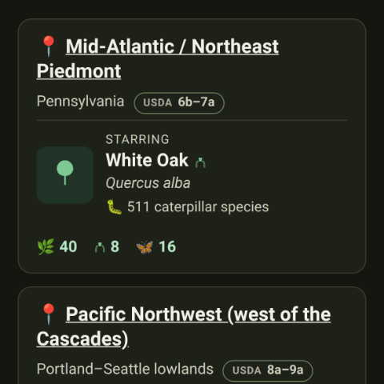

# Changelog

All notable changes to Indigene are recorded here.

The format follows [Keep a Changelog](https://keepachangelog.com/en/1.1.0/),
with two house rules:

- **Versions are feature releases, not schedules.** A version is cut when a
  coherent piece of the product lands — then it gets a number, a name, and a
  date (the way [Maison](https://github.com/olivierlacan/maison) does it).
  There is no fixed cadence and no conventional-commit machinery; just add
  plain bullets to **Unreleased** as you go, and promote them to a numbered
  release at a natural boundary.
- **The public "What's new" page is compiled from this file.** Bullets are
  published verbatim for a general audience — including kids and
  grandparents — so write them in plain, warm words. Developer-facing
  housekeeping belongs here too: start such a bullet with `Internal:` and the
  compiler cleans it out of the page. Reviewing a changelog entry in a PR
  *is* reviewing the release notes.

The bold line under each version heading is the release's name; it becomes the
subtitle on the What's new page.

## [Unreleased]

### Added

- **Indigene speaks French.** Every word of the app — the screens, the buttons,
  the plain-language explanations, the privacy and sources pages — is now
  available in French as well as English. It picks your language from your
  phone or browser the first time, and you can change it whenever you like from
  **Réglages / Settings**, reachable from the bottom of every page.
- **You choose your own units, whatever language you read in.** Heights,
  rainfall and winter cold can be shown in metres and °C, or in feet and °F,
  and the choice is completely separate from the language. A French speaker
  gardening in Ohio can read in French and measure in feet; an American in
  Bordeaux can read in English and measure in metres. Left alone, it simply
  follows whatever your phone's region uses. See
  [Settings](https://indigene.app/#/settings).
- **Plants and animals are called by their French names.** *Quercus robur* is
  "Chêne pédonculé", not a translation of "Pedunculate Oak" — because that's
  the name recorded for it in France's own national reference list. The names
  come from TAXREF (the Muséum national d'Histoire naturelle), Tela Botanica,
  and — for North American plants that France has never needed to name — the
  Canadian VASCAN list. Where nobody has given a plant a French name, we show
  its scientific name rather than inventing one, and the page says so. Where
  each name comes from is set out on the
  [Where our numbers come from](https://indigene.app/#/sources) page.
- The size drawing, the plant cards and the "no taller than…" filters all read
  in your units: a tree is "24 m × 21 m" or "80 ft × 70 ft", and the ruler up
  the side of the drawing is marked in whole metres or whole feet — never in
  the awkward converted numbers you'd get from just swapping the label.
- **An [About page](https://indigene.app/#/about)**, linked from the bottom of
  every page. It says why Indigene exists — most gardens are green and nearly
  lifeless, and one native plant restarts the food web the same season — who
  it's for, and the five things it refuses to do: never use a word it hasn't
  explained, always show its error bars, never state a number it can't trace to
  somebody else, never ask anything of you, and keep working where the signal
  doesn't.
- [Browse by wildlife](https://indigene.app/#/wildlife) now has a **"Filter by
  name…" box** at the top, the same one the plant lists have. Type "swallow"
  and the page keeps only the swallowtails; type "hummingbird" and you get the
  bird and the moth named after it.
- Each group of creatures also has **its own page** now — just the
  [butterflies](https://indigene.app/#/wildlife/butterflies), just the
  [moths](https://indigene.app/#/wildlife/moths), just the
  [bees](https://indigene.app/#/wildlife/bees),
  [birds](https://indigene.app/#/wildlife/birds), or
  [mammals & others](https://indigene.app/#/wildlife/mammals). A row of buttons
  hops between them, so "show me only the moths" is one tap and a link you can
  send to someone.
- **Pick a region on the wildlife page and see only the creatures that live
  there.** [Browse by wildlife](https://indigene.app/#/wildlife) now has a
  "Show the wildlife of" picker at the top. Choose the Pacific Northwest and
  the list narrows to the 15 creatures its native plants support — and the
  plant count on each card counts only that region's plants, so nothing on the
  page is claiming more than it should. It works together with the group
  buttons, so ["the butterflies of the French
  Alps"](https://indigene.app/#/wildlife/in/france-alpine/butterflies) is a
  page, and every combination has its own web address you can bookmark or send
  to someone.
- **Your plant list for a spot has the same "Filter by name…" box.** After
  Indigene ranks the natives for where you're standing, you can type a name to
  pull one out of the list — "oak", "milkweed", "fern" — and the part you typed
  is underlined in green on each card that matches. It searches the *whole*
  ranked list, not just the twenty-five cards on screen, so a plant sitting at
  number thirty still turns up.
- Indigene has a proper little sprout icon in your browser tab now, instead of
  the blank page symbol every site gets when it hasn't been given one.
- Posting an Indigene link somewhere — a message to a friend, a group chat, a
  social post — now shows a proper preview card with the name, a line about
  what the app does, and the sprout, rather than a bare address or nothing at
  all. For now every link shows the same card; showing the particular plant
  you shared is coming.

### Changed

- **Every creature now says where it lives, instead of wearing a "native"
  badge.** Every animal on the wildlife pages is native — that's the whole
  point of the page — so a "native" tag on all of them told you nothing. In
  its place, a creature found in more than one of our regions shows a map pin
  and a number: 📍 3 for the monarch. Hover it on a computer to read the region
  names, or tap it on a phone to open them as links — each one goes straight to
  the rest of the wildlife those regions' plants support. A creature we've
  mapped in a single region shows nothing at all, because "1" is the same
  non-fact the old badge was. Its own page still names its regions in full,
  with the sourced sentence about where it's native right below.
- When you filter a region's plant list — say you type "oak" on
  [Florida (north & central)](https://indigene.app/#/regions/florida-central) —
  the part of each name you typed is now **underlined in green**, exactly the
  way it already was on the [search page](https://indigene.app/#/search). The
  little line under the list says the same thing in both places too ("1 of 23
  plants match “oak”."), so the two ways of looking for a plant no longer
  behave like two different features.
- Internal: the filter box, its counting line, and the match underlining now
  come from one shared component (`components/filter-field.ts`) used by the
  region rosters, the wildlife index, and — for the highlighting — the search
  page, instead of three near-copies. It holds no words of its own: every
  sentence is passed in already translated, because a count line doesn't
  survive being assembled from a noun slot in French.
- **The buttons on your plant list moved below the plants.** "Back" and "Save
  this spot" used to sit above the list, so the first thing you met on the page
  that finally shows your plants was a way to leave it — and an offer to save a
  spot whose plants you hadn't seen yet. They now come after the list, where
  every other step in Indigene keeps its buttons.
- Internal: `scripts/shoot.mjs` takes a `--fill` flag, so a screenshot can be
  taken of a page whose interesting state only exists once something has been
  typed into it, and a `--picks REGION` flag that walks the flow to the ranked
  plant list — the one page no URL can reach, because it needs a spot.
- Internal: `filter-field.ts` splits into two shapes over one field —
  `filterField` hides rows already on the page, `filterBox` hands the query to
  the caller for the ranked list, which has to re-rank rather than hide.
- The French plant descriptions for **Atlantic France** — Paris, Nantes and
  Bordeaux — are written in French. The other regions' descriptions are still
  in English while we work through them, and any page showing English text says
  so plainly rather than leaving you to notice.
- Internal: a hand-rolled `lib/i18n.ts` (~2 KB, no dependency) over typed
  dictionaries in `app/src/locales/`. English is the key set and every other
  locale is typed against it, so a missing or misspelt key is a compile error,
  not a blank on someone's phone. `lib/units.ts` converts at the display edge —
  the catalog keeps storing feet and °F exactly as sourced, so a units switch
  can never corrupt data.
- Internal: `app/scripts/check-vernacular.mjs` re-asks TAXREF, VASCAN and
  Wikidata whether the names we display are the names they give, and
  `.github/workflows/vernacular.yml` runs it quarterly (the build sandbox's
  egress blocks all three hosts). A name its own source doesn't back fails the
  job; a gap does not.
- Internal: `scripts/shoot.mjs` takes `--locale`, so screenshots can be captured
  as a phone in that region would render them — language *and* default units.
- Internal: the bundle is now ~240 KB gzipped (was ~179 KB) — two full
  dictionaries, the name tables and the French prose overlay. Re-measured and
  updated in `README.md`, `PROJECT_BRIEF.md`, `app/README.md` and
  `docs/ecoregion-plan.md`.
- Internal: the language and units pickers live in
  `components/prefs-controls.ts` rather than inside a screen, so the fuller
  settings screen being built separately can import them and delete the thin
  `steps/settings.ts` shell in one line.
- Mistyping an Indigene address used to quietly drop you on the front page, as
  though that's where you'd meant to go. Now there's a real
  **"We couldn't find that page"** page that says what happened and offers
  three ways back in — [the regions and their plants](https://indigene.app/#/plants),
  [search](https://indigene.app/#/search), and
  [browse by wildlife](https://indigene.app/#/wildlife). Links to real pages
  still go straight through, exactly as before.
- The app's icon had square corners with a faint ghost of a curve near them —
  a rounding that was drawn but never actually cut out. The corners are round
  now, on the tab icon and the one you get when you install Indigene to your
  home screen.
- The region cards on [Meet the natives](https://indigene.app/#/plants) no
  longer carry a little "USDA 6b–7a" badge. Those numbers are a gardener's
  shorthand for how cold a place gets in winter, and on a page whose only job
  is "pick where you live" they were an answer to a question nobody had asked
  yet. Each card now simply names its place. The badge is still on every
  region's own page — right where you've settled on a region and started
  asking what grows there.
- Indigene has its own address now: **[indigene.app](https://indigene.app/)**.
  Older links to `olivierlacan.github.io/indigene` still work — they forward to
  the new one — and everything you saved stays where it is on your device.

### Fixed

- The first pages published at [indigene.app](https://indigene.app/) arrived as
  a bare list of blue links, with no colours, pictures, or layout. The page was
  still asking for its styles and code at the old address, which lived one
  folder deeper; on the new site those files sit at the top, so nothing
  answered. They're asked for in the right place now, and the app looks and
  works the way it always has.
- Sharing a plant's own web address (like
  [indigene.app/plants/quercus-alba](https://indigene.app/plants/quercus-alba))
  works again on the new domain. Those addresses are handed back to the app on
  arrival, and the hand-off was still assuming the old, one-folder-deeper site.
- Internal: the deploy builds with `BASE_PATH: /` rather than reading
  `configure-pages`' `base_path`, which reports `/indigene` for a project Pages
  site and produced the 404ing `/indigene/assets/…` URLs. `app/public/CNAME`
  now ships the custom domain in the artifact, `404.html` folds the whole path
  into the hash route, and the release-notes pages declare their canonical URLs
  under `indigene.app`.

### Added

- Internal: the identifier reconcile job can now ask iNaturalist directly for
  the taxon ids Wikidata's hand-contributed property doesn't carry. Those ids
  are what join a plant's page to the real sightings shown on it, so a missing
  one means "See it growing near you" quietly has nothing to show. Run it from
  Actions → "Reconcile registry identifiers" with scope `missing-inat` (or
  `npm run reconcile -- --missing inat`) and it opens a PR with the result; a
  monthly schedule now runs the same gap-fill on its own, so a newly added
  region doesn't wait on the quarterly full pass.
- Internal: a `Registry` check on pull requests that touch plant data. It
  rebuilds the registry to catch a committed copy drifting from the catalog,
  and annotates the PR with per-region iNaturalist coverage — the gap that let
  21 of the Pacific Northwest's 44 natives, and every French region, ship with
  no taxon ids and nothing to say so. `npm run registry:check` prints the same
  table locally.

### Fixed

- Internal: reconcile no longer discards every identifier it found for a taxon
  just because neither IPNI nor World Flora Online had an entry to anchor it
  to. The anchor decides `primaryId`, not whether the rest of the bag is worth
  keeping — a plant iNaturalist knows and IPNI doesn't still deserves its
  sightings link.
- Internal: `app/package-lock.json` caught up with the 0.13 version bump.

## [0.13] - 2026-07-29

**More places, and a better way in**

[Before](docs/screenshots/pr-56/explore-before-dark.png) · [After](docs/screenshots/pr-56/explore-after-dark.png)

### Added

- **All of France is covered now, not just the rainy west.** Three more parts
  of the country have their own plant lists, each a genuinely different set of
  plants rather than the same list shuffled:
  [the Mediterranean south](https://indigene.app/#/regions/france-mediterranean)
  (Provence, the Languedoc coast and Corsica — holm oak, strawberry tree,
  mastic, cistus, thyme and lavender, where the hard part of the year is the
  dry summer, not the winter),
  [the continental east](https://indigene.app/#/regions/france-continental)
  (Burgundy, Lorraine, Alsace and the Rhône — oak, beech, hornbeam, lime,
  hawthorn and the chalk-meadow flowers that most French butterflies grow up
  on), and
  [the Alps](https://indigene.app/#/regions/france-alpine)
  (spruce, larch, arolla pine, bilberry, alpenrose and gentian, for gardens
  high enough to have real snow). Stand anywhere in mainland France and the
  app will now know which of the four lists is yours. The Pyrenees are
  deliberately left out for now: they're a different set of plants again, and
  we'd rather say "not yet" than guess.
- **A lot more to plant in the Pacific Northwest.** The
  [west-of-the-Cascades list](https://indigene.app/#/regions/pnw)
  grows from 24 plants to 44 — red alder, bitter cherry, vine maple, western
  hemlock, Oregon ash and Pacific dogwood among the trees; salmonberry, red
  elderberry, evergreen huckleberry, ninebark, twinberry and hazelnut among
  the shrubs; and, for the first time in this region, a milkweed — showy
  milkweed, the only thing a monarch caterpillar can eat, and the western
  monarch badly needs more of it.
- **Twenty new creatures on the
  [wildlife pages](https://indigene.app/#/wildlife)**, most
  of them European, so browsing by animal now works for France too. Some of
  the best stories in the whole app are in here: the
  [large blue](https://indigene.app/#/wildlife/large-blue),
  whose caterpillar eats wild thyme for a few weeks and then gets carried into
  an ants' nest, where it spends ten months eating the ants' own young; the
  [spotted nutcracker](https://indigene.app/#/wildlife/spotted-nutcracker),
  which buries tens of thousands of pine seeds each autumn and plants the next
  Alpine forest with the ones it forgets; and the
  [two-tailed pasha](https://indigene.app/#/wildlife/two-tailed-pasha),
  Europe's biggest butterfly, which can raise its young on one plant only.
- **Every release now has a page of its own.** The
  [What's new page](https://indigene.app/release-notes/)
  is one long list, which made "look at what just shipped" impossible to
  share — you could only send someone the whole page and tell them where to
  scroll. Now each release also lives at its own address, like
  [Version 0.12](https://indigene.app/release-notes/0.12/):
  tap a release's title to open it on its own, with a link back to all
  releases and links on to the ones either side of it. The address stays put
  as new releases pile up on top.
- Indigene now reaches its first place outside the United States: the mild,
  rainy Atlantic west and north of **France** — Paris, Nantes, Bordeaux, Rennes,
  Lille and the countryside between. Stand in a spot there and you'll get
  [native French plants](https://indigene.app/#/regions/france-atlantic) —
  oak and hawthorn, blackthorn and hazel, woodland bluebells, honeysuckle and
  foxgloves — ranked for your exact spot, each with what it does for local birds,
  bees and butterflies. It's a carefully chosen starter list that will grow —
  and the Mediterranean south, the Alps and eastern France have since landed
  alongside it (see above), so the whole of mainland France is covered. (The
  app itself still speaks English for now — French wording is the next step.)
- The app now understands Europe's natural regions, not only North America's.
  Online, it checks the official European map of
  [biogeographical regions](https://www.eea.europa.eu/en/datahub/eea-data-policy)
  — Atlantic, Continental, Alpine, Mediterranean — to tell whether a French spot
  is in the Atlantic zone this first list is really for, and says so plainly when
  it isn't yet.
- Elevation and slope now work anywhere in the world, not just the US: outside
  the United States the app reads the land's height from a global source, so the
  new French spots get the same "how high, how steep" reading.
- Internal: the ecoregion layer is now provider-agnostic — a spot resolves to a
  real ecoregion via US EPA (Omernik) in the conterminous US or the EEA
  Biogeographical Regions service in Europe, chosen by coordinates, both falling
  back to the coarse box offline. `EcoregionInfo` carries a `provider` + `code` +
  `name`, and a region declares the codes it covers under `meta.ecoregion`.
  See `docs/france-localization-plan.md`.
- **A page that shows our working.**
  [Where our numbers come from](https://indigene.app/#/sources)
  lays out, in plain words, where every figure in Indigene actually comes
  from — and marks each one as counted from real data, worked out by the app,
  or our own estimate. It also says what we're assuming, and names the numbers
  we think are most likely to be wrong, starting with the 0–100 scores, which
  are judgments we made rather than anything anyone measured. If you spot a
  mistake, the page tells you how to tell us. We'd rather be corrected than
  believed.
- Internal: the European Lepidoptera host-count source is identified, open, and
  now **integrated** — the Gaytán et al. 2026 species-level European
  Lepidoptera–plant interaction matrix (CC-BY 4.0, `doi:10.1002/ece3.73004`),
  which the dataset's own README confirms records *larval* hosts. A new
  `scripts/build-host-counts.mjs` (`npm run host-counts`) reduces it to a
  committed `data/sources/eu-lep-plant-matrix/host-counts.json` — 973 genera ×
  8 European zones — and reports a region's rows without rewriting them. Counted
  at genus level, filtered to members that grow in the region's zone and are
  native to Europe; the unfiltered figure is kept wherever it differs. The
  shared `HOST_ANCHOR` stays 520 and **no US score moved**. DBIF (CEH/BRC, OGL)
  remains an unrun cross-check. See `docs/host-counts-plan.md`.

### Changed

- **[Explore](https://indigene.app/#/plants) now leads with
  places, not paragraphs.** It used to open with five plant descriptions, which
  meant reading a lot before you got to the one thing you actually have to
  choose: where you are. Each card is now a region — its name, the part of the
  country it's tuned to, one native starring on the front of it, and three
  small figures for what the list adds up to. The whole card takes you to that
  region's plants. The full description of the starring plant lives on the
  plant's own page, one tap away, which is where it belonged.
- "Or browse by wildlife" has moved **below** the list of regions. It's a good
  way in, but it was being offered before anyone had a chance to look at what
  was behind the first door.
- **Explore, the wildlife list and each region's plant list now use a big
  screen properly.** On a laptop they were a phone-shaped ribbon down the
  middle with empty space either side; now the cards spread into columns, so
  you see a whole group at a glance instead of scrolling past one card at a
  time. Sentences keep their comfortable reading width — it's the cards that
  wanted the room.
- **The USDA hardiness zone is its own little badge now**, instead of trailing
  along in brackets after the place. "Pennsylvania (USDA zones 6b–7a)" is now
  "Pennsylvania" with a small `USDA 6b–7a` tag beside it — shorter, and the
  number is easy to spot because it's the one thing on the line that looks
  like a label. Hover or tap-and-hold it and it explains what the zone means;
  on the French regions it also says that American zones are a translation
  there rather than the local way of talking about winter cold. The reference
  places got shorter too, so they all read as a couple of city names rather
  than a paragraph — and on a big screen, where the region cards sit side by
  side, the tags line up in a neat column down the right of each card instead
  of landing in a different spot on every one.
- **The little counts on each card sit at the bottom now, always in the same
  place.** They used to follow the text, so they landed at a different height
  on every card and you had to hunt for them. They're also shorter — an icon
  and a number rather than a spelled-out label, which stops them wrapping onto
  two lines on a phone. Hover or tap-and-hold any of them to read what it
  means.

- **The French caterpillar counts are now counted, not estimated.** Every
  [Atlantic France plant](https://indigene.app/#/regions/france-atlantic)
  shipped with an honest guess at how many kinds of caterpillar it feeds,
  because no European tally was available to us. One is now — an open dataset
  covering 5,152 European butterflies and moths — so the guesses are gone and
  every plant carries a real figure, with the source named on its page. Almost
  all of them went up: the guesses had been cautious. Blackthorn and wild
  cherry turned out to feed 318 kinds of caterpillar rather than the 100 and
  120 we'd estimated, and cowslip 35 rather than 6. A few went the other way —
  holly feeds 7, not the 12 we'd guessed. Because these numbers help decide
  which plants we recommend first, some French results are now in a different
  order, and we think a fairer one.
- **"Where our numbers come from" is easier to read, and says "calculated"
  instead of "worked out".** The
  [page that tells you how sure we are](https://indigene.app/#/sources)
  used to be one long list where every line ended in a little capsule —
  COUNTED, WORKED OUT, OUR ESTIMATE — so you had to read eleven capsules to
  work out which numbers were solid. Now the numbers are sorted into three
  groups under plain headings — **Counted**, **Calculated**, **Estimated** —
  firmest first, with one sentence under each heading saying what it means.
  You can see at a glance that most of what the app tells you was counted by
  somebody, and that the 0–100 scores are our own judgment. "Worked out" is
  gone: the honest word is **calculated**, meaning the app does the sum itself
  from measured numbers, using a method someone else published, so you could
  redo it on paper and get what we got.
- Internal: `make-thumb.mjs` takes `--top <px>`, starting the square that many
  source pixels down instead of at the very top of the capture. A release
  whose feature sits below the fold of a full-page screenshot (0.12's "See it
  near you" section) can now show the feature rather than the page header.
- Internal: `build-release-notes.mjs` writes `release-notes/<version>/` for
  every release alongside the index, and both declare a `<link rel=canonical>`
  built from a new `SITE` constant — so a release has one address rather than
  competing with an anchor on the index. The release card renderer is shared:
  on the index its heading links to the release's page, on that page it is the
  `h1`. Thumbnails are copied once into the notes folder and reached from a
  release page one directory up. The whole `dist/` is already uploaded by the
  Pages deploy, so the subdirectories ship with no workflow change.

### Fixed

- **The menu at the top of the app no longer spills onto a second line.** On
  many phones the row of links — Explore, Search, Wildlife, and the bookmark —
  had grown just wide enough to drop below the Indigene name, making the green
  bar taller than it needed to be. The links now sit tidily on one line again,
  from small phones up.
- **Tapping "Explore" or "Wildlife" at the top of the screen now always takes
  you to the top of that page.** Two things were wrong: the page could end up
  nudged down by about the height of the green bar, and tapping the name of the
  section you were already in did nothing at all — so if you were halfway down
  the wildlife list and tapped "Wildlife" hoping to get back to the top, you
  stayed put.
- Internal: `main.focus()` scrolls `#main` into view, and `#main` starts below
  the sticky header — measurably parking the document 61px down. The
  `scrollTo(0, 0)` on the next line masked it wherever focus scrolling is
  synchronous; now the scroll happens first and the focus call passes
  `preventScroll`. A delegated handler on `.site-nav` catches same-hash clicks,
  which fire no `hashchange` and so never reached the router.
- Internal: the registry builder and its audit each kept a hardcoded list of
  regions, and both had silently fallen behind — Atlantic France shipped
  without ever reaching the registry. Both now read `data/regions.ts`. The
  registry goes from 116 to 198 taxa.
- Internal: region coverage boxes may now overlap. France's four
  biogeographical zones interlock and no set of rectangles separates them, so
  `regionsForCoords` returns every candidate box and the live ecoregion code
  picks between them; offline, the tightest box wins. Verified against 17
  French cities in both modes, and Bend, Oregon still correctly falls through
  to no list east of the Cascade crest.
- Internal: `docs/coverage-plan.md` records how to decide which natives a
  region needs next, and which open datasets (GBIF occurrences, USDA PLANTS
  county data, WCVP, DBIF, GloBI, iNaturalist phenology) can carry which
  field. The bundle figure quoted across the docs is re-measured: ~125 KB →
  ~179 KB gzipped.

## [0.12] - 2026-07-28

**See it near you**

[Before](docs/screenshots/pr-46/before-dark.png) · [After](docs/screenshots/pr-46/after-dark.png)

### Added

- **See the wildlife near you.** Every creature in the
  [wildlife browser](https://indigene.app/#/wildlife) — the
  monarch, the luna moth, the gopher tortoise — now has a "See it near you"
  section. Share your location *or* just type a ZIP code, and Indigene pulls
  real, community-verified photos of that animal spotted near there, or you can
  look it up in a region where it's found without being there. The photos come
  live from iNaturalist, called by your own browser, and each one is credited
  to the person who took it — the same way the plant pages already show a plant
  growing near you. (Some entries are broad groups, like "Jays, turkeys &
  woodpeckers," that don't point at a single species; those don't offer the
  lookup.)
- **Don't want to share your exact location? Type a ZIP code instead.** Both
  "See it near you" (on wildlife pages) and "See it growing near you" (on plant
  pages) now offer sharing your location and entering a ZIP code (or town) as
  two equal choices — so you can see what's growing and flying near a place
  without handing over precise location, and it works the same on a desktop
  with no GPS.
- Internal: the wildlife layer identifies each animal to iNaturalist by its
  scientific name (already curated in the catalog), resolving it to a taxon id
  at request time via iNaturalist's taxa endpoint — synonym-tolerant, and it
  fails safe (an unresolvable name shows nothing rather than the wrong
  creature). Sightings are cached per animal + area in IndexedDB for 7 days,
  reusing the plant layer's cache machinery (`lib/inaturalist.ts`,
  `lib/wildlife-sightings.ts`). The shared photo-card and credit rendering now
  lives in `components/observation-ui.ts`, used by both the plant and wildlife
  "near you" sections; the ZIP/location choice is a shared
  `components/location-prompt.ts` used by both, feeding the existing Open-Meteo
  geocoder.
- **A Privacy & safety page**, in plain words for everyone — including kids and
  the grown-ups looking out for them. It lays out the whole story: no account,
  no tracking, no ads; your saved spots stay on your device; your location is
  used only when you tap, and you can always type a ZIP code instead of sharing
  it; and exactly which public science services your browser talks to, and what
  each is told. Reach it from the footer on any page, and from a short "🔒 …"
  note right where the app asks for your location or saves a spot. See it at
  [Privacy & safety](https://indigene.app/#/privacy).
- Internal: the Privacy & safety page and its contextual links go through a
  shared `components/privacy-link.ts`. Combined with the wildlife-sightings
  work above, the bundle is now ~111 KB gzipped.
- Every [region's page](https://indigene.app/#/regions/mid-atlantic)
  now opens with the same kind of at-a-glance number tiles a plant's page has:
  how many native plants are on the list, how many kinds of caterpillars its
  best plant can feed (up to 511 species on white oak alone in the
  Mid-Atlantic), how many kinds of wildlife we can tie to the list by name,
  and how many keystone plants it holds. Tap any tile for a plain-words
  explanation of what the number means and where it comes from.
- A filter box on region pages: start typing a name — common or scientific —
  and the plant list narrows as you type, no more hunting through 40 rows or
  bouncing out to the search page.
- The category buttons on region pages (Trees, Shrubs, Ferns…) now each carry
  their little plant silhouette, matching the drawings on the plant rows below.

### Changed

- **One tap now takes you through every sighting's photos, not just one
  person's.** When a plant or animal page finds several sightings near you, the
  photo viewer used to stop at the edge of the sighting you tapped — to see the
  next person's pictures you had to close it and start again. Now the arrows
  (and the ← → keys) carry straight on into the next sighting, all the way
  through everything on the page. It always tells you where you are — "9 / 11 ·
  sighting 3 of 4" — and as you cross from one sighting to the next, the credit
  underneath changes with it: the new photographer's name, their licence, where
  and when they saw it, and a link to that sighting on iNaturalist.
- **Bigger, tidier photo thumbnails.** A sighting's little square photos now sit
  three to a row and fill the width of the card, instead of being a fixed small
  size that left a lonely fourth picture stranded on a second row. When a
  sighting has more pictures than fit, the last one wears a small "+2" badge —
  tap it and the viewer will page through all of them.
- Internal: `observation-ui.ts` now exports `observationList()` rather than a
  per-card builder, which is what lets a thumbnail hand the lightbox the whole
  set of sightings on screen; the lightbox holds a flattened reel of
  `{photo, observation}` frames and rebuilds its credit block per frame.
  `whereWhen()` moved to `lib/inaturalist.ts` (both the card and the lightbox
  print it now, and components → lib keeps the imports one-way). New
  `app/scripts/shoot-sightings.mjs` screenshots the "near you" sections with
  iNaturalist's API and photos stubbed, for containers with no route to it.
- Opening a sighting photo is smoother now. The photo viewer that pops up when
  you tap an iNaturalist picture (on a plant's or an animal's page) used to
  open small, then jump taller and draw the photo in stuttery strips as it
  arrived. Now the viewer opens at its full size right away, shows a small
  spinning circle while the photo travels, and the finished picture fades in
  gently. The link back to the original sighting on iNaturalist is now a quiet
  underlined link under the photographer's credit instead of a big button.
- Region pages now lead with just the region's name — "Mid-Atlantic /
  Northeast Piedmont" instead of "Every native we know for Mid-Atlantic /
  Northeast Piedmont" — and say the rest in one short line underneath.
- The showcase cards on [Meet the natives](https://indigene.app/#/plants)
  are more compact: the keystone mark now sits beside the plant's name as a
  small arch, and "Full profile →" tucks in at the end of the description
  instead of taking a line of its own.
- The fine print about what "native" means on a region's page is shorter and
  plainer: native here means native to this region specifically — outside it,
  treat the picks as untested.
- The [Where are you standing?](https://indigene.app/#/location)
  step now shows one way of setting your spot at a time. Using your device's
  location leads, and a small link — "Don't want to use your location? Use a
  ZIP code or pick a region instead." — swaps in the town search or the region
  list when you ask for it, with a matching link to switch back. Less to
  scroll past, and the Next button is always close by.
- Picking your region by hand is now two taps: choose a region and the list
  folds down to just your choice (a "Show all regions" link brings the rest
  back), then press Next when you're sure — instead of being whisked to the
  next step the moment you tap.

## [0.11] - 2026-07-28

**Never a blank page**

### Added

- A public [What's new page](https://indigene.app/release-notes/):
  every release of Indigene described in plain words, newest first. Nothing to
  install, no account — it's just a web page you can share.
- A "See what's new" link in the app's footer, so the notes are one tap away.
- Each release on the What's new page can now show a small picture of what
  changed, taken when the change was made. Tap it to see the full-size
  screenshot; Before and After links sit underneath when both exist.

### Changed

- The footer — the fine print about open source and data sources, plus the
  "See what's new" link — now appears at the bottom of every page, not just
  the home screen.
- The little person standing beside each plant in the growth chart now looks
  like a person — head, shoulders, arms and legs — instead of a featureless
  post, at every size from towering oak to knee-high wildflower.
- The growth chart's labels are a touch bigger and drawn in the page's
  strongest text color, so the feet markings and year captions are easy to
  read in both light and dark mode — even in bright sun.
- When you [search for a plant](https://indigene.app/#/search),
  each result now underlines the part of its name that matches what you typed,
  so you can see at a glance why it showed up. And when a plant matched through
  a name it's less commonly known by — like "Maypop" for Purple
  Passionflower — the result now says so with an "Also called" line.
- The What's new page now uses the changelog's own headings — Added, Changed,
  Fixed — instead of renaming them.
- Release notes now link to the things they describe — like the
  [wildlife browser](https://indigene.app/#/wildlife) — so
  you can go straight from reading about a feature to trying it.
- Internal: this `CHANGELOG.md` is the single source of the What's new page.
  `app/scripts/build-release-notes.mjs` compiles it to a static, app-styled
  HTML page; the Pages deploy workflow runs it on every push to `main`, and a
  `Changelog entry` PR check reminds authors to update this file (apply the
  `skip-changelog` label when nothing notable changed). `app/package.json`'s
  `version` tracks the latest cut release.
- Internal: one thumbnail per release, enforced by the compiler — a square
  480px crop made with `node scripts/make-thumb.mjs <screenshot.png>`,
  committed next to its source under `docs/screenshots/pr-<n>/`, referenced
  as `` under the release name. Thumbnails
  are copied into the built page; full-size screenshots and other
  repo-relative links are served straight from `raw.githubusercontent.com`.
- Internal: there is no custom `Internal` changelog section — the sections
  are exactly Keep a Changelog's. A bullet prefixed `Internal:` (like this
  one) stays in the changelog and is cleaned out of the compiled page.

### Fixed

- The home page could come up completely blank — most often in Safari, and
  especially with an older Indigene tab still open in another window. The
  app was waiting forever for its on-device storage to answer before showing
  anything. It now draws the page right away and fills in your saved spots
  once storage responds.
- The page now appears instantly on every load — the brief pause some
  browsers still showed is gone, because nothing waits on on-device storage
  before drawing anymore.
- The Saved menu no longer sticks on "Loading…" when on-device storage won't
  answer (Safari sometimes leaves it hanging). After a couple of seconds it
  says it couldn't open your saved spots, suggests closing other Indigene
  tabs, and offers a Try again button.
- "See it growing near you" could get stuck at "Asking iNaturalist…" for the
  same reason — the app checks its on-device photo cache before asking, and
  that check could hang forever. It now gives the cache a couple of seconds,
  then asks iNaturalist directly.
- The bottom row of the growth chart's labels — like "(5′6″)" under the
  little person — was getting cut off by the caption below. The chart now
  leaves proper room for both label rows.
- The growth chart could be drawn with the wrong colors — pale, hard-to-read
  labels on a light page — if your device switched between light and dark
  looks after the page loaded. The chart now redraws itself when that
  happens, and also when the screen size changes.
- The app's top menu now wraps onto a second line when it truly runs out of
  room — like with very large text settings — instead of quietly spilling off
  the edge of the screen, where the Saved button could end up out of reach.
- Internal: the page can no longer scroll sideways (`overflow-x: clip` on
  `body`). The overflowing header was silently widening the document, which
  is what put a dark right-edge gutter and a floating 🔖 in every full-page
  screenshot: the capture honors the document width while the sticky header
  only spans the viewport. A fresh capture's width must now equal the
  viewport width. The four release thumbnails that had the gutter baked in
  (0.7–0.10) were regenerated with `make-thumb.mjs --crop`, which trims
  legacy captures to their true viewport width.
- Internal: screenshots now render with real phone font metrics. The capture
  container has none of the app's named fonts, so text fell through to DejaVu
  Sans (~10% wider than a phone renders — which is what made the header
  overflow, then wrap, in captures). A SessionStart hook
  (`.claude/hooks/session-start.sh`) installs Roboto and points `system-ui`
  at it, so headless Chromium lays out like an Android phone; the nav also
  sits a touch tighter at phone widths, so it fits Roboto with room to spare
  instead of by one pixel. Screenshots are also hi-DPI now: a new
  `scripts/shoot.mjs` (playwright joins the dev dependencies) captures at a
  real phone's 3× pixel ratio, so embedded shots render crisp on retina
  displays — with `--dpr 1` kept for very long full-page records.

## [0.10] - 2026-07-27

**Everything in plain sight**

[Before](docs/screenshots/pr-36/home-before-dark.png) · [After](docs/screenshots/pr-36/home-after-dark.png)

### Added

- A [Browse page](https://indigene.app/#/browse) of its
  own: the regions we cover and "start from a plant" now live one tap from
  the home page — for anyone who'd rather look around
  without sharing their location.

### Changed

- Almost nothing hides behind a tap anymore. A plant's ecosystem, propagation,
  and reference sections, the 60-second soil check, the sky-scan explanation,
  and each result's score breakdown are now simply visible on the page. The
  only fold-away panels left are the two big ones on results — "What matters
  most?" and "Filters" — and those now have clear Open/Close buttons.
- The home page gets to the point: the pitch, why native plants matter (in
  plain view, no tap needed), the Start button, and a quiet link to browsing.
- Words got shorter and warmer across the home page, including the promise
  that matters most: "No account, no tracking. Everything stays in your
  browser and works offline."

### Fixed

- Buttons on phones now keep their labels on one line — like "See it growing
  near me" and "Check my location" — so they never break in half or shift
  while you're reaching for them.

## [0.9] - 2026-07-27

**See them growing for real**

[Before](docs/screenshots/pr-32/before-dark.png) · [After](docs/screenshots/pr-32/after-dark.png)

### Added

- Real photos of recommended plants growing near you, taken by people in your
  area and shared on [iNaturalist](https://www.inaturalist.org). Open a
  plant's page and tap "See it growing near you" — nothing loads until you ask.
- Not standing there right now? Tap "Look it up where it's native" and pick a
  region instead: you'll see photos of the plant from anywhere it naturally
  grows, no location sharing needed.
- Photos open in a full-screen viewer inside the app, so you can look closely
  and then get right back to where you were.

### Changed

- Nearby photo results only show plants that are truly native around that
  spot, so a garden escapee never sneaks into your recommendations.
- Every photo credits the person who took it and links back to their original
  sighting, and only photos their takers chose to share openly are shown.

## [0.8] - 2026-07-22

**One plant, one name**

[Before](docs/screenshots/pr-25/plant-refs-before-dark.png) · [After](docs/screenshots/pr-25/plant-refs-after-dark.png)

### Added

- A built-in plant name book (a *registry*): every plant Indigene knows has
  exactly one entry tying together its scientific name, its common names, and
  its identity in the world's big plant databases.
- A [search page](https://indigene.app/#/search): type any
  name — common or scientific — and Indigene finds the
  plant, or says honestly when a name could mean more than one plant.
- Plant pages now show **references**: links to the very same plant at USDA,
  GBIF, and other authorities, so you can double-check anything we say.
- iNaturalist links now land directly on that exact species' page.
- Internal: the registry is generated from the catalog (`npm run
  registry:build`) and audited (`npm run registry:check`); it also ships as a
  hostable static JSON artifact under `app/public/registry/`. External
  identifiers (Wikidata + GBIF) are reconciled by a scheduled workflow that
  writes to `registry.overrides.json` via PRs; the workflow was hardened to
  not red-fail when PR creation is blocked, and `registry:check` now survives
  reconciliation.

### Fixed

- Internal: corrected the long-stale bundle-size figure across the docs
  (~28 → ~96 KB gzip) and documented keeping it honest in `CLAUDE.md`.

## [0.7] - 2026-07-21

**Meet the wildlife**

[Before](docs/screenshots/pr-18/plant-milkweed-before-dark.png) · [After](docs/screenshots/pr-18/plant-milkweed-after-dark.png)

### Added

- [Browse by wildlife](https://indigene.app/#/wildlife):
  start from a butterfly, moth, bee, bird, or mammal and
  see which native plants support it — because "which plants bring monarchs?"
  is often the real question.
- Every plant–animal tie says *how* the plant helps (caterpillar food, nectar,
  berries, seeds, or shelter) and how much the animal depends on it — from
  "this is its only host plant" to "one of many it can use".
- Every wildlife relationship names its source, with links straight to the
  species record where the source has one.
- Plant pages show the wildlife each plant brings in, with links both ways.

### Changed

- You can now cap results by mature height and spread — handy for planting
  under a window or a power line.
- The header now fits every phone: "Saved" moved into a compact menu, and the
  app's name is never cut off.
- Relationship tags are one short word each; tap one to read the full meaning.

### Fixed

- Wildlife pages got the same comfortable margins as the rest of the app.

## [0.6] - 2026-07-19

**Readable by everyone**

[Before](docs/screenshots/pr-17/welcome-before-dark.png) · [After](docs/screenshots/pr-17/welcome-after-dark.png)

### Changed

- The home page now leads with why native plants matter — what's at stake for
  birds, butterflies, and clean water — before it explains what the app does,
  and shows how to ask for your area if it isn't covered yet.
- Every color in the app, in light mode and dark mode, now meets the strictest
  readability standard there is (WCAG AAA contrast) — so text stays clear in
  bright sunlight, and for readers whose eyes need more contrast.

## [0.5] - 2026-07-18

**Make more of them**

### Added

- Every plant now has "how to make more of it": plain-words tips for growing
  new plants from seed, cuttings, or division — free plants for you, your
  neighbors, and the birds.

### Changed

- Every expandable section in the app now looks and works the same way — once
  you've opened one, you know how to open them all.
- Section titles are shorter and clearer, and the first step is now simply
  called "Spot".
- You can share a link that opens a specific section of a plant's page, like
  its propagation tips.

## [0.4] - 2026-07-17

**No GPS required**

### Added

- Type your town or ZIP code instead of sharing your location — or just pick
  your region from a list. Nobody is ever asked for coordinates.
- If Indigene doesn't have a plant list for a spot yet, it says so the moment
  you pick it — and shows you what it does cover, plus where to request your
  area.

### Changed

- Place lookups now come from OpenStreetMap, and the app always shows town
  names, never raw numbers.
- Garden jargon never stands alone: terms like "zone 8b" always come with a
  plain-words translation and a link to learn more.

### Fixed

- The place-search button now sits right beside the search box, at a matching
  size.
- The map no longer promises that fine-tuning the pin sharpens the sun
  estimate (it doesn't).

## [0.3] - 2026-07-16

**Explore and share**

### Added

- [Explore pages](https://indigene.app/#/explore): browse
  every plant Indigene knows without sharing your
  location — and every plant, region, and category has its own address you can
  share with anyone.
- Full plant lists for each region at shareable addresses, with a switcher to
  hop between regions.
- A stat grid on every plant, like a trading card. Tap any stat to read what
  it means in plain words.
- The location map now draws real streets from OpenStreetMap (with a simple
  grid when you're offline).
- Short explanations appear right where a new idea first shows up, so you
  learn as you go — and growth expectations now come from the data, not
  guesses.

### Changed

- Getting around got easier: section navigation, a way back home from every
  page, and region links right on the home page.
- The re-sort panel can be closed, the growth chart is right-sized, keystone
  species wear a little arch icon, and species counts show their sources.
- The GPS map starts one zoom level farther out, so the neighborhood you see
  is one you recognize.

## [0.2] - 2026-07-15

**More places, real boundaries**

### Added

- Three new regional plant lists: the Pacific Northwest west of the Cascades,
  north & central Florida, and south Florida & the Keys — and the app picks
  the right list from where you're standing.
- Regions now follow real ecological boundaries (EPA ecoregions), not straight
  lines on a map — so a spot just east of the Cascade crest no longer gets the
  west-side list, and Florida splits where the subtropics truly begin. The
  confirm screen names the actual ecoregion you're standing in.
- Every plant's naming and classification is backed by named, linkable
  taxonomy sources.
- Indigene went live on the public web — free to visit in any browser, nothing
  to install (though you can add it to your home screen).
- Internal: deploys to GitHub Pages via Actions on every push to `main`; the
  optional Ruby API is not part of the deploy.

## [0.1] - 2026-07-12

**Stand in a spot**

### Added

- The first version of Indigene. Stand somewhere, share your location, and get
  native plants that will truly thrive right there — ranked by what they do
  for birds, butterflies, bees, soil, and water.
- Sun, measured honestly: answer one simple question about your spot's sun, or
  point your camera at the sky and let the app measure sun-hours itself. The
  simple question always works; the camera is optional.
- The ground gets checked, not assumed: the app says "the soil map says clay —
  here's a 60-second hand test to see if that's true where you're standing."
- Every plant shows how big it will really get in 1, 3, 5, and 10 years, drawn
  to scale beside a person — no surprises a decade later.
- The ranking is transparent and yours to adjust, with filters for deer
  resistance, thorns, pet safety, and plants that survive with zero watering.
- Saved spots stay on your phone. The whole app works offline, installs to
  your home screen, and never asks for an account.
- A starting list of 40 Mid-Atlantic / Northeast Piedmont natives with real
  size-over-time and ecosystem numbers.
- Internal: vanilla TypeScript on the DOM — no framework, zero runtime
  dependencies — bundled by Vite. A thin, optional Hanami 2 API (`server/`)
  proxies site data; the PWA works without it.

[Unreleased]: https://github.com/olivierlacan/indigene/compare/d81160b...HEAD
[0.13]: https://github.com/olivierlacan/indigene/compare/fa0dd4c...d81160b
[0.12]: https://github.com/olivierlacan/indigene/compare/2aec57f...fa0dd4c
[0.11]: https://github.com/olivierlacan/indigene/compare/f84450c...2aec57f
[0.10]: https://github.com/olivierlacan/indigene/compare/9453251...f84450c
[0.9]: https://github.com/olivierlacan/indigene/compare/6e72889...9453251
[0.8]: https://github.com/olivierlacan/indigene/compare/d45eda0...6e72889
[0.7]: https://github.com/olivierlacan/indigene/compare/6affce6...d45eda0
[0.6]: https://github.com/olivierlacan/indigene/compare/c8a56bc...6affce6
[0.5]: https://github.com/olivierlacan/indigene/compare/a54ef90...c8a56bc
[0.4]: https://github.com/olivierlacan/indigene/compare/253bede...a54ef90
[0.3]: https://github.com/olivierlacan/indigene/compare/c0e70f6...253bede
[0.2]: https://github.com/olivierlacan/indigene/compare/ac8be53...c0e70f6
[0.1]: https://github.com/olivierlacan/indigene/commits/ac8be53
