# Changelog

All notable changes to Indigene are recorded here.

The format follows [Keep a Changelog](https://keepachangelog.com/en/1.1.0/),
with three house rules:

- **Versions are feature releases, not schedules.** A version is cut when a
  coherent piece of the product lands, and gets a number, a name and a date
  (the way [Maison](https://github.com/olivierlacan/maison) does it). Add
  plain bullets to **Unreleased** as you go.
- **The public "What's new" page is compiled from this file.** Bullets are
  published verbatim to a general audience — including kids and grandparents —
  so write them in plain, warm words. Reviewing a changelog entry in a PR *is*
  reviewing the release notes. Developer housekeeping starts with `Internal:`
  and the compiler cleans it out of the page.
- **A bullet is one change, said once — 50 words at the outside.** Aim for
  about 35: what changed, and who it's for. Anything that needs more than that
  needs the page it describes, not the release notes; reasoning goes in an
  `Internal:` bullet. The compiler fails the build over the limit, because
  every word here is also a word somebody translates.

The bold line under each version heading is the release's name; it becomes the
subtitle on the What's new page.

## [Unreleased]

### Changed

- **What's new says the same things in half the words.** Every entry on
  [What's new](https://indigene.app/release-notes/) has been cut back to what
  actually changed — the longest ran to 273 words, which is an essay, not a
  release note. The plant and region pages still hold the detail.
- **The Before and After pictures open in the page now.** Tapping one used to
  send you off to a bare image file on another site, with the back button for a
  way home. They open in the same viewer the app uses for photographs.
- **And you can move between them.** The ‹ › buttons, the ← → keys and a swipe
  all page through a release's pictures. Escape, ✕, the backdrop or a swipe
  down puts them away.
- Internal: the What's new page carries a cut-down copy of the app's lightbox
  (`LIGHTBOX_SCRIPT` in `build-release-notes.mjs`) — same gestures, thresholds
  and classes, no bundle behind it. Each release's reel is read off its own
  anchors (`data-lb`, `data-lb-i`), so there's no second list to drift and
  every link still opens the picture with the script switched off; a thumbnail
  that is also the "after" shot is one frame, not two. `npm run notes:check`
  drives it in Chromium and asserts all 32 outcomes.
- Internal: `build-release-notes.mjs` fails on a published bullet over 50
  words, `Unreleased` included, so the `Changelog` check catches verbosity in
  review rather than on the live page. `Internal:` bullets are exempt. The
  written rule is in CLAUDE.md under *Every word is short by default*, which
  applies to all site copy — every word here is also a word somebody
  translates into French.

### Fixed

- **Four notes meant for the people building Indigene had been appearing on
  What's new.** They're written for developers and are supposed to stay out of
  the page — a stray pair of asterisks was enough to let them through.
- Internal: the `Internal:` mark now matches with or without bold, which is
  what had been leaking those four; the four bullets are written plainly again.
- **Region names are shorter, with the qualifier on the line below.** "Florida
  (south & the Keys)" is now **South Florida**; "Pacific Northwest (west of the
  Cascades)" is **Pacific Northwest**. The brackets had been pushing a name onto
  three lines on a phone.
- **On a laptop the region map sits beside the numbers, not below them.** It
  used to stretch the full width of the page and push the plant list off the
  bottom of the screen. On a phone, nothing changes.
- **Each region map is one shape now, and its coastline is smoother.** The lines
  dividing it into a dozen pieces answered no question anyone asks, and the
  jagged edges were an artefact of keeping the file small.

## [0.24] - 2026-08-07

**Southern California, and a map of where every region ends**

[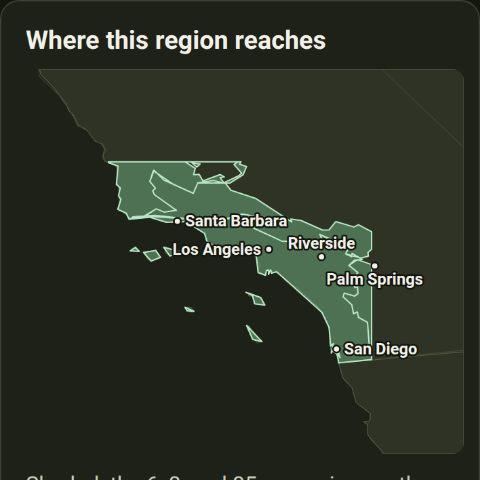](docs/screenshots/pr-103/map-card-dark.png)
[The region list before](docs/screenshots/pr-103/regions-before-dark.png) · [and after](docs/screenshots/pr-103/regions-after-dark.png)

### Added

- **Southern California is covered — 60 natives for the coast and the
  foothills.** Coast live oak, the sages, toyon, manzanita, matilija poppy, and
  the wildlife each one feeds. The care notes are written for a dry summer:
  which plants must never be watered in July. [See the
  list](https://indigene.app/regions/ca-south-coast).

- **Three plants a nursery might sell you by mistake in southern California.**
  Tropical milkweed beside the native narrowleaf one, pampas grass beside
  deergrass, firethorn beside toyon — each with the tells you can check standing
  in front of the plant. [See them](https://indigene.app/lookalikes).
- Internal: `docs/west-coast-plan.md` maps the rest of the West Coast — the
  eight regions that fill Oregon and California, the Omernik ecoregion codes and
  coverage boxes each one claims, the order they'll be built in, and why the
  deserts come last rather than getting a chaparral list they can't use.
- **Every region page now has a map of the region.** [The Pacific
  Northwest](https://indigene.app/regions/pnw), for one, now shows how far it
  reaches: the area shaded, the state lines around it, and a caption naming the
  landmarks at its edges. The maps work offline.
- **The Mid-Atlantic now follows real ecoregion edges**, not a rectangle drawn
  on a map — see the shape on [its
  page](https://indigene.app/regions/mid-atlantic). A few places just outside
  it, like the Adirondacks and north-western Ohio, are now told we have no list
  yet, rather than handed the wrong one.
- Internal: the region maps are drawn once, at build time, by
  `app/scripts/build-region-maps.mjs` (`npm run maps:build`) and committed as
  one small SVG per region under `app/public/maps/`. It queries the same EPA and
  EEA services the app already uses live, plus Natural Earth for country
  outlines, then simplifies, clips each region's polygons to its coverage box —
  the drawing is the app's real selection rule, not an artist's impression — and
  renders paths. No map library, no tile host, no third-party request at
  page-view time, nothing added to the JS bundle: the page loads an ``. The
  drawn size of each map lands in a generated `src/data/region-maps.ts` so the
  page reserves the right space and the roster doesn't jump when a map arrives.
- Internal: `npm run candidates -- --region <id>` proposes the next plants for a
  region and says why it picked each one, so growing a list stops being a matter
  of who remembers what. It ranks the most-recorded plants inside the region's
  own coverage box (GBIF), drops the ones iNaturalist lists as introduced rather
  than native for that region's states, and rewards a candidate that brings a
  genus the list doesn't have yet. It writes nothing into the app — the output is
  a shortlist under `docs/candidates/`, and every row still needs a person to
  check it's actually sold locally and to write the size curve and the notes by
  hand. Its blind spot is stated in its own output: ranking by how often a plant
  is recorded misses the scarce valuable one, which the first run proved by
  missing the Pacific Northwest's one absent keystone genus.
- Internal: GloBI was probed as a source for American caterpillar host counts,
  and the answer is no. `npm run probe:globi` had never been runnable; run now,
  its gate question fails — the life-stage columns that would separate "a
  caterpillar ate this leaf" from "an adult sat on this flower" exist and are
  empty in every record sampled (0 of 500), and while `bbox` filtering does
  work, only 12 of 1,202 worldwide oak records survive the Mid-Atlantic box
  against Tallamy's 511 for the same genus and place. So US host counts stay
  genus-level estimates, labelled as such, and GloBI keeps its place only in the
  wildlife-ties layer where no count is involved. Verdict written into
  `docs/us-host-counts-plan.md` §2 and `data/sources/globi/README.md`, snapshot
  committed at `data/sources/globi/probe.json`. Two bugs found in the probe
  while doing it: it filtered locality with `lat`/`lng`, which GloBI silently
  answers with an empty body, and a first fix read a column by position from
  rows keyed by name, which reported a field as fully populated when it is
  entirely empty.
- Internal: the scripts that fetch from the open internet — the registry
  reconciler, the vernacular and look-alike audits, the photo harvester, the
  probes — now run through a configured HTTP proxy instead of silently around
  it. Node's built-in `fetch` ignores `HTTPS_PROXY` unless `NODE_USE_ENV_PROXY=1`
  is set at startup, so every request left directly, came back `403`, and read
  exactly like "this host is blocked by policy" — a diagnosis this repo's own
  comments had written down as fact. The npm scripts now set the variable,
  `scripts/_net.mjs` refuses a direct `node scripts/…` run with a sentence
  naming the real problem, and the three probes that had no npm entry got one
  (`inat:check`, `probe:globi`, `probe:eea`).

- Internal: a way to publish the site without GitHub Actions, after a deploy
  job sat fifteen minutes without ever getting a runner and left two merges
  undeployed. `npm run publish:cloudflare` uploads the build straight to
  Cloudflare Pages (the mirror that takes GitHub out of the path, and leaves a
  permanent indigene.pages.dev to hand out during an outage);
  `npm run publish:gh-pages` force-pushes the build to a branch, which GitHub's
  branch-based Pages pipeline serves — a different subsystem from the runner
  pool that failed. `enablement: true` came off the workflow's Configure Pages
  step so that a failover can't be silently reclaimed by a build job that
  succeeds on a day the deploy job can't. Runbook, including what any host has
  to do with `404.html` and how to prepare the domain for failover, in
  `docs/publishing.md`.
- **We now count how many times each page is opened.** One outside service is
  told that a page was opened, and which one. No cookie, nothing kept to
  recognise you, never your location or a spot you've saved, and search words
  are stripped off first.
- **Every way to grow more, and when in the year to do it.** Each of the fifteen
  techniques now has a page of its own, with the season to do it in. [Ways to
  grow more](https://indigene.app/planting) lays them all against the four
  seasons.
- **Every technique page says how long you'll be waiting, and how it usually
  goes wrong.** Three to six weeks for a soft green cutting; eighteen months for
  a seed with double dormancy. Each names the one slip that wastes the attempt.
- **The windows are seasons and signs, never dates.** February in the Florida
  Keys is April in Pennsylvania. So: take the cutting if a bent shoot tip snaps
  cleanly, collect fern spores when the frond backs turn brown, sow fresh seed
  the week it ripens.
- **A reading list for anyone who wants more than one page.** [Ways to grow
  more](https://indigene.app/planting) now names the eight free resources every
  propagation note is written from, with a line on what each is good for.
- **Sharing one of these pages shows a picture of the year.** Post a link to
  [taking hardwood cuttings](https://indigene.app/planting/hardwood-cuttings)
  and the preview arrives with winter lit, before anyone has tapped anything.
- **Every plant now has a photo page of its own.** The whole plant from a few
  steps back, then leaves, flowers and fruit up close, each chosen by a person
  and labelled. Look for **📷 More photos** under the plant's name — [alder
  buckthorn's](https://indigene.app/plants/frangula-alnus/photos), for instance.
- **Animals can have real photographs too.** The butterflies, bees, birds and
  mammals in [Wildlife](https://indigene.app/wildlife) were drawn as an emoji,
  which tells you it's a butterfly and nothing about *which* one. They now use
  real, credited photographs.
- **The French edition is finished.** Choosing French used to translate the
  buttons and then hand you English paragraphs. Every one of them is now in
  French: all 229 plants, the 65 [animals](https://indigene.app/wildlife) and
  the 27 [look-alikes](https://indigene.app/lookalikes).
- **Plants that grow in two regions now say the right thing in each.** Hornbeam
  is a garden hedge in the west of France and a great forest tree in the east.
  The French follows that split, as the English always did.
- **You can send someone straight to one part of a plant's page.** Every heading
  now carries a small `#`: tap it and the link to [that
  section](https://indigene.app/plants/lupinus-polyphyllus#propagation) is
  copied. Follow one and the card lights up green for a moment.

### Fixed

- **Three groups of animals had French names that never appeared.** "Osmies et
  andrènes", "Abeilles spécialistes des astéracées" and "Colibri d'Anna et
  colibri roux" were written down, but filed in a way that showed a French
  reader the scientific name instead.

### Changed

- **"Ways to grow more" uses the whole screen on a computer.** [The
  page](https://indigene.app/planting) was a narrow strip of cards with empty
  space either side; the techniques now lay out three across, and it is half as
  tall. On a phone, nothing changes.
- **"What it does for the ecosystem" is a third shorter.** The seven things a
  plant does now sit as a list you can read in one look, with each explanation
  appearing when you ask for it — hover on a computer, tap on a phone.
- Internal: the photo-harvesting pipeline now asks iNaturalist for a plant's
  *flowering* and *fruiting* observations as separate queries, using the
  community's own Plant Phenology annotations, so the flower and fruit shots
  aren't buried under forty close-ups of leaves. The pixel pass guesses at
  whole-plant vs. leaf as well, but only to re-order the shortlist — every
  candidate stays assignable to every slot, and the choosing stays human. The
  review page gained slots per subject, the animals, and the picks already
  committed as its starting state. See `docs/hero-photos.md`.
- Internal: the four close-up angles per plant live in their own JSON,
  imported dynamically, so the bundle every reader downloads doesn't grow by the
  gallery nobody has opened — the page itself adds about 3 KB, taking the app to
  ~340 KB gzipped.
- Internal: the translated catalog prose is fetched as its own file rather
  than built into the app, so an English reader downloads none of it. The app
  stays at ~340 KB gzipped; French adds ~122 KB, once, and only in French. If
  that file can't be fetched the pages fall back to English exactly as an
  untranslated row always did.
- Internal: `locales/prose.fr.ts` is now `locales/prose.fr/`, one file per
  region plus one each for the animals and the look-alikes, and a key may be
  qualified with a region (`"Carpinus betulus@france-continental"`) so one taxon
  can carry a different translation per list. New `npm run prose:check` reports
  per-region coverage, names every field still falling back to English, and
  fails on two files claiming the same key — which is how the Douglas-fir /
  holly / ivy collision was caught.

## [0.23] - 2026-08-04

**Photographs on every list, arriving gently**

[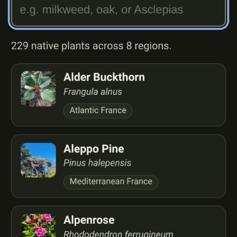](docs/screenshots/pr-92/plants-after-dark.png)
[Before](docs/screenshots/pr-92/plants-before-dark.png) · [After](docs/screenshots/pr-92/plants-after-dark.png)

### Added

- **You can now see what a plant looks like without opening it.** The
  photographs from the plant pages now appear on the lists too: [every native
  Indigene knows](https://indigene.app/plants), and every region's roster. Where
  nobody has chosen a photograph yet, the drawing stays.

### Changed

- **Pictures arrive gently instead of appearing in pieces.** Every photograph is
  now fetched quietly and shown only once it is whole, fading in over whatever
  was there. Nothing on the page shifts when one lands.
- **Photographs are asked for at the size they're actually shown.** A picture
  drawn the size of a stamp used to be downloaded at the size of a postcard. A
  plant page now costs about a third of what it did.
- **A long list only loads the pictures you can see.** Scrolling the plants page
  no longer sets 190 photographs downloading at once. On a slow connection, or
  with data saving on, the lists keep their drawings and fetch nothing.
- Internal: `lib/photo.ts` is now the only place that decides how an
  iNaturalist photo is asked for and shown — `renditionFor` picks the smallest
  of iNaturalist's five fixed renditions that covers a slot at the device's
  pixel ratio (measured: square 7.6 KB, small 38 KB, medium 126 KB, large
  438 KB, original 1.7 MB; `original` is asked for nowhere), a shared
  `IntersectionObserver` holds a thumbnail's job until it is within 400 px of
  the viewport, a four-deep queue caps concurrency with the plant hero
  jumping it, and every image is `decode()`d before the `.photo-fade` class is
  lifted. A job that hasn't decoded in 8 s releases its slot and finishes on
  its own, so one stalled request can't starve a list. The observer's targets
  are swept for disconnected nodes past 300 entries — an
  `IntersectionObserver` holds targets strongly, and the plants index rebuilds
  ~190 cards per keystroke.
- Internal: **no worker resizes anything, deliberately.** Shrinking an image
  locally requires downloading every byte first, so it cannot shorten the wait
  it appears to address, and iNaturalist already publishes five sizes on a CDN
  — asking for `small` costs 38 KB where fetching `medium` to shrink costs 126.
  The reasoning is written down at the top of `lib/photo.ts` so the idea isn't
  re-proposed.
- Internal: `npm run hero:colors` (`scripts/hero-colors.mjs`) averages each
  pick's `square` rendition into a `color` on `hero-photos.json` — decoded by
  Chromium, the same borrowed-decoder arrangement `_photo-quality.mjs` uses, so
  the repo keeps zero runtime dependencies. ~1.6 KB for all 204 picks. The
  field is optional; without it the hero falls back to `--brand-bg`. Documented
  as stage 3½ in `docs/hero-photos.md`.
- Internal: the plant hero's `aspect-ratio` moved from the `` to the
  `.plant-hero-shot` button. An `` with no `src` yet is not a replaced
  element — it lays out as its alt text — so the ratio on the image reserved a
  text-high strip and the waiting colour showed as a bar.
- Internal: `PHOTO_CACHE_LIMIT` 240 → 600. The mix shifted from lightbox-sized
  photos to 8–38 KB thumbnails, so the entry count can rise while the bytes
  stay around 30 MB.
- Internal: `scripts/shoot.mjs --photos DIR` serves the iNaturalist photo hosts
  from a local mirror laid out like their URLs. The list pages now load
  photographs, which made screenshots depend on the network and race whichever
  tiles had landed; the mirror holds the real bytes, so a capture is both
  truthful and repeatable.

## [0.22] - 2026-08-04

**More to plant, and who it feeds**

[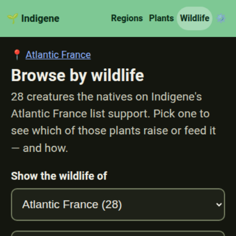](docs/screenshots/pr-91/wildlife-after-dark.png)
[Before](docs/screenshots/pr-91/wildlife-before-dark.png) · [After](docs/screenshots/pr-91/wildlife-after-dark.png)

### Added

- **A lot more to plant in the Pacific Northwest.** The list grew from 44 plants
  to 58, and deliberately not with more trees: sedges and a rush for wet ground,
  two more ferns, stonecrop and buckwheat for a dry sunny edge, trailing
  blackberry, Indian plum.
- **Early blue violet, and why it matters.** Also new to the Northwest, and the
  only thing a fritillary caterpillar will eat — but it hatches in late summer
  and doesn't feed until April, so the patch has to still be there next spring.
- **Atlantic France doubled, from 23 plants to 46.** Heather, broom, bramble,
  bird's-foot trefoil, red clover, hop, aspen, bilberry, wych elm, wild pear,
  beech and more. Several flower in August, September and October — which is
  when the old list ran out of flowers.
- **The app now says who eats what, all over Europe.** Atlantic France named an
  animal for five of its plants; it now names them for 43 of 46. Look at [alder
  buckthorn](https://indigene.app/plants/frangula-alnus): a brimstone
  caterpillar can eat it and nothing else.
- **And in the Northwest too.** Douglas-fir, western hemlock and western
  redcedar now name the crossbills and siskins that live off their cones.
  Twenty-two new animals joined [the wildlife
  pages](https://indigene.app/wildlife) in all.
- Internal: `npm run coverage` prints what each region's plant list is missing —
  forms below three, moisture × sun cells with nothing in them, months with
  nothing in flower, the wildlife ties that aren't written, and (for the four
  French regions) the food-web genera we don't ship, joined live against the
  committed Gaytán host counts. This is `docs/coverage-plan.md` §4 step 1, which
  that document asked for and left unbuilt. `--region <id>` for one region,
  `--top N` for how far down the genus ranking to look.
- Internal: `docs/coverage-gap-pnw-france-atlantic.md` is what the script found
  and what was done about it. Atlantic France went from 9 of the top 30
  Oceanic-temperate host genera to **29 of 30** — 41% of the caterpillar records
  to 97% — and both regions now clear every form floor and every site cell.
  Deliberately still open: the Northwest's October bloom month and *Ceanothus*;
  Atlantic France's November and December; and dandelion, the only top-30 genus
  left out, on plantability grounds.
- Internal: `app/scripts/probe-globi.mjs` and the *US host counts* workflow ask
  GloBI whether America can have computed host counts the way Europe does. It
  ships nothing on purpose — the gate is whether the source can tell a
  caterpillar eating a leaf from an adult sipping at a flower, and
  `docs/us-host-counts-plan.md` commits to abandoning the approach if it can't.
  This is the structural gap the audit exposed: European lists can be grown from
  a ranking and American ones can't.

## [0.21] - 2026-08-03

**Real photographs, and a thumb to page them**

[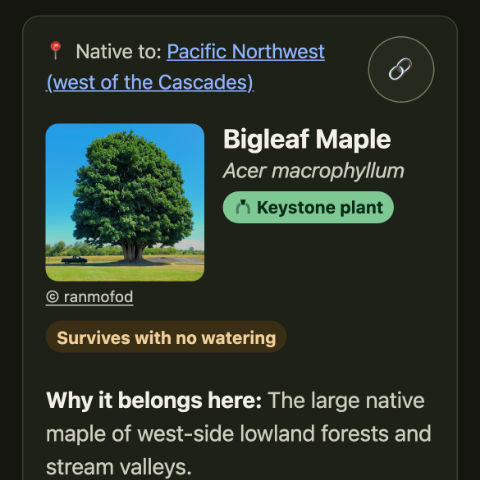](docs/screenshots/pr-85/after-dark.png)
[Before](docs/screenshots/pr-85/before-dark.png) · [After](docs/screenshots/pr-85/after-dark.png)

### Added

- **Real photographs on plant pages.** Where we've found a good, freely-licensed
  picture, a plant's profile opens with a photograph of the species instead of
  the drawing — 188 plants so far, each credited to the naturalist who took it.
- **Swipe through the photos.** When a photo of something [someone spotted near
  you](https://indigene.app/wildlife) opens large, you can slide it aside with
  your thumb to see the next one, instead of aiming for the small ‹ › buttons at
  the edges.
- **Swipe down to put a photo away.** Drag the big photo downwards and the
  viewer falls with your thumb — let go and it's closed, change your mind and it
  springs back. Handy when the ✕ is in the far corner and your thumb is not.
- Internal: both gestures live in `attachSwipe` in `components/lightbox.ts`,
  which picks an axis in the first 8 px of travel and holds it: sideways routes
  into the same `step()` the buttons and the ← → keys call, downwards into the
  same `close()` as ✕ / Escape / the backdrop, so no path can drift apart from
  the others. Touch and pen only — a mouse drag on a picture already means
  something else. The falling panel fades `.lb-overlay`'s *background*, not its
  opacity (fading the overlay makes the photo itself see-through), and
  `close()` undoes a drag in flight so the reused overlay never greets the next
  photo tilted. `npm run swipe:check` drives real Chromium touch input at a
  built, served `dist/` and asserts all 17 outcomes (drags, flicks, twitches,
  wrap-around, dismissal both ways, and a clean reopen).

## [0.20] - 2026-08-01

**What's new, and where it would go**

[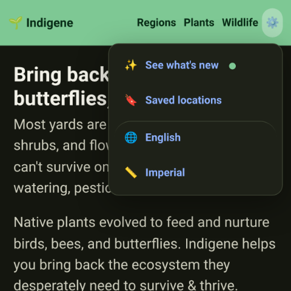](docs/screenshots/pr-88/menu-after-dark.png)
[Before](docs/screenshots/pr-88/menu-before-dark.png) · [After](docs/screenshots/pr-88/menu-after-dark.png)

### Added

- **A plant's page tells you when you've already got somewhere to put it.** If
  you've saved a spot, [a plant](https://indigene.app/plants/quercus-alba) now
  says whether it would suit that ground, by name, under *Want to plant it?* Tap
  the spot to see what else thrives there.
- Internal: `lib/saved-fit.ts` runs every saved spot through `assessSpot`, the
  same function the manual checker calls, so a plant can never look better here
  than it would in the ranked list for that same spot; ideal ahead of decent,
  then by fit. `assessSpot` gains an optional region override, honoured the way
  `activeEntry` and the ranked flow already honour it, so a spot the reader
  hand-placed just over a boundary is judged against the region they said it's
  in. The row's sub-line shows the spot's own sun answer rather than the
  verdict's first reason — the reasons are ordered for reading in full, so the
  first is the hardiness line, and on a spot whose site lookup never landed
  that's "couldn't confirm how cold winters get here", which reads as a warning
  under a green verdict. It's derived from the stored hours, not the stored
  label, which was written in whatever language the spot was saved in.
- **A green dot when something's new, and nothing when it isn't.** A small mark
  sits beside *What's new* — in the ⚙️ menu and at the foot of every page —
  until you've looked. [What's new](https://indigene.app/release-notes/) then
  marks the releases you haven't read.
- **Someone arriving for the first time gets no dot at all.** "New since your
  last visit" means nothing to a person who has never visited. They start level
  with today, and get a dot the next time something lands.
- **What that costs you, in full: a version number and two dates.** No account,
  no count of how often you come, no record of what you looked at. It stays in
  your browser, and [Settings](https://indigene.app/settings) shows you both
  values with a button that throws them away.

### Changed

- **The ⚙️ menu opens with what's new, and saved spots are one row away.** The
  menu used to hold the list of your spots, which meant opening it showed
  "Loading…" first. It's now a single row through to [the Saved
  page](https://indigene.app/#/saved), there the moment you press the gear.
- Internal: `lib/visits.ts` owns the record — `indigene.visits` in
  localStorage, holding `seenVersion`, `lastVisitAt` and `visitAt`. localStorage
  rather than the IndexedDB kv store every other memory uses, because this is
  the one thing read by two documents: the app, and the standalone page
  `build-release-notes.mjs` compiles, which has no bundle behind it and has to
  decide what to mark before it paints. The compiled page therefore carries a
  mirror of the read/write/compare logic; both sides are commented as such.
  `compareVersions` compares part-by-part as numbers, because string order puts
  `0.9` after `0.19` and that comparison is the whole feature. A visit that
  resumes within 30 minutes is the same visit, so a reload — or a trip to the
  notes and back — can't redefine "since your last visit" as "since you
  clicked".
- Internal: `build-release-notes.mjs` fails the build when `app/package.json`'s
  version and the newest changelog heading disagree. The app reads the former to
  decide whether to show the dot and the page publishes the latter, so drift
  between them is a wrong badge for everyone, silently; CLAUDE.md already says
  to bump both when cutting a release, and this makes forgetting a build error.
- Internal: the "since your last visit" notice is one line because a sentence
  and a pill button measurably cannot share a row at 360px — so the notice *is*
  the control: the whole box is a button, and the visible label is the count
  and nothing else, so it holds that line whatever the number grows to; its
  accessible name is where "and pressing it takes you there" gets said. With exactly one release
  waiting there is nowhere to jump, so it degrades to a plain line. There is
  deliberately no badge on the gear itself: on a header filled with brand green
  a mark on a 16–18px emoji reads as a smudge on the header rather than a badge
  on a control, in a corner or centred on the hub alike. The trade is real —
  nothing signals a new release until the menu is opened or the footer reached
  — and a badge nobody can parse is noise on every screen, not a signal.
- Internal: `app-menu.ts` is synchronous now — no `listSpots`, no loading,
  error/retry or empty states, and the panel is drawn on open rather than
  populated in two passes. The seven `savedMenu.*` strings it needed go with
  it, from both locales. The two settings rows take their accessible name from
  the `footer.languageIs` / `footer.unitsIs` phrases instead of gluing a colon
  on in code, which had been quietly imposing English spacing on French.
- Internal: bundle re-measured — 273 KB → 275 KB gzipped, and the four docs
  quoting the figure updated (they had drifted to ~268 KB before this change).
  Dropping the menu's database path gave ~0.4 KB of that back.

## [0.19] - 2026-08-01

**A spot it remembers, and links that travel**

[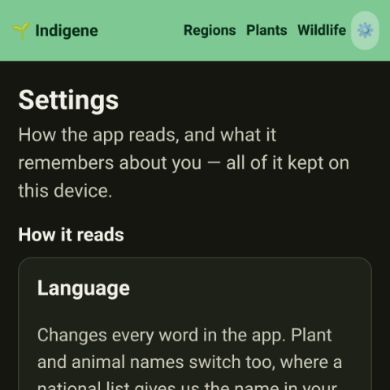](docs/screenshots/pr-81/settings-after-dark.png)
[Before](docs/screenshots/pr-81/settings-before-dark.png) · [After](docs/screenshots/pr-81/settings-after-dark.png)

### Added

- **Indigene remembers the spot you were last standing in.** Come back tomorrow
  and it opens where you left off, with the sun and soil answers you gave for
  it. Move somewhere new and it asks again — those answers belong to that patch
  of ground.

- **A starting region, if you'd rather skip the map for good.** If you already
  know your area, choose it once under **Starting region** in
  [Settings](https://indigene.app/settings) and every visit begins there.

- **Settings now lists everything this device remembers about you**, in plain
  words, each with a button that throws it away: your last spot, your starting
  region, and the goal your plant lists are ranked by. All of it stays in your
  browser.

- **The goal you last chose sticks, and now says so.** Ask for a list that
  favours birds and it stays that way next visit. That was always true, but
  nothing told you, so the order looked like Indigene's own opinion. Settings
  names it, with one button back.
- **A real photograph where a plant's page had a drawing.** The picture beside a
  plant's name used to be chosen by its *type* — the same shrub shape for every
  shrub. It can now be a photo of that species, with the photographer named
  below.

- Internal: the hero-photo pipeline — `npm run hero:harvest` (iNaturalist's
  most-favourited research-grade observations per plant per region, restricted
  at the query to republishable CC licences), `_photo-quality.mjs` (Chromium
  decodes, Node fetches — no new dependency), and `npm run hero:review` (a
  self-contained page for picking, with `localStorage` persistence and a JSON
  download). `.github/workflows/hero-photos.yml` runs the harvest quarterly and
  opens a PR with the shortlists. Scoring leans on **subject isolation**, not
  global sharpness: measured on real photos, Laplacian variance ranked a
  cluttered hillside (5731) far above a clean close-up (361), because busy
  frames are high-frequency everywhere. Nothing here changes a photo the app
  shows until a pick is committed; `lib/hero-photo.ts` reads them, preferring
  the displayed region and falling back to any reviewed one, and reshapes a pick
  into an `ObservationSummary` so the lightbox credits it through the existing
  path rather than a second implementation. See `docs/hero-photos.md`.

- **Every plant now has its own picture on a shared link.** Send someone [white
  oak](https://indigene.app/plants/quercus-alba) and the preview is a card made
  for that plant: its name, its shape, and four numbers — caterpillars fed,
  creatures that depend on it, months in flower, how tall it grows.

### Changed

- Internal: every CI job has a name that says what it does, so a check reads
  `Registry / Rebuild, audit & taxon-id coverage` rather than `Registry /
  check`. Job ids are untouched (`needs:` still resolves), and `main` has no
  required status checks to re-point.

- **Every screen that reuses an answer you already gave says so, in one line** —
  a sentence and a link to where it's kept, rather than small print between you
  and the question.

- **Indigene's French is now, plainly, the French of France.** A *bleuet* is a
  blueberry in Montréal and a cornflower in France, and we had been taking names
  from both countries' lists at once. [Where the names come
  from](https://indigene.app/sources) says which French it means.

- **Several dozen North American plants keep their French name, with an honest
  label on it.** Those names came from the Canadian list. Nearly all are what a
  French gardener would say anyway, so they stay while each is traced back to a
  French list.

- Internal: the locale is declared once, as `LOCALE` in `lib/i18n.ts` (`fr` →
  `fr-FR`), and stamped on `<html lang>` and every `Intl` formatter. Name
  sources are locale-scoped in `lib/names.ts`: `TAXA_FR` is a
  `NameTable<FrenchSource>`, so VASCAN — kept in `NameSource` as the fr-CA
  authority it is — is a compile error in the French table rather than
  something a reviewer has to catch. The 87 rows it had supplied now carry
  `src: "pending"`.

### Fixed

- **The link you copy is now the link that shows the plant.** The address bar
  used to show a `#` version, and everything after a `#` never reaches the
  website — so a link copied from there arrived as a plain "Indigene" card with
  no picture. Not any more.

- **A few saved links no longer land on "we couldn't find that page."** Opening
  [Language](https://indigene.app/settings/language) or
  [Units](https://indigene.app/settings/units) from a bookmark showed the
  not-found page instead of the setting.

- Internal: the seven form glyphs move from `components/plant-card.ts` to
  `components/plant-glyphs.ts` — same geometry, no DOM — so `silhouetteFor`
  (browser) and `glyphMarkup` (headless) draw one set from one table.
  `scripts/gen-plant-cards.mjs` renders the 1200×630 cards; they're committed
  under `public/og/plants/` and `prerender.mjs` only points at them, so a build
  never runs Playwright. `--check` reports a plant with no card. The four fact
  icons are drawn to the glyph set's rules rather than set as emoji: at
  thumbnail size, four full-colour emoji on one flat green-on-dark card read as
  clutter. They're JPEG at quality 90 (~48 KB each, 9.7 MB for the catalog):
  the brand wash is a smooth gradient, which puts the same card at 224 KB as a
  PNG — 47 MB across the catalog — and at 1:1 the JPEG is indistinguishable
  from lossless. Nothing but a link unfurler ever fetches them, so the weight
  is a repository cost, not a page-load one. `check-routes.mjs` now also
  verifies every page's `og:image` resolves to a file that was actually built.

- Internal: share cards carry the plant's **illustration, never its hero
  photograph**, written down in `docs/hero-photos.md` and in the generator's own
  header because that's where someone would be tempted. Four of the five
  licences the harvest accepts require attribution and a share card can't carry
  any — it lands in a chat as a bare image with nowhere to put the credit, which
  is the one rule that pipeline doesn't break. Compositing would also make the
  card a derivative work (two of those licences are ShareAlike), and committing
  it would republish someone's photo permanently, where the in-app hot-link
  honours a deletion or a licence change at once.

- Internal: the card generator measures each card in the browser before
  capturing it and refuses to write one that doesn't fit — a fact label wrapping
  onto two lines, the name and the drawing colliding, a row overflowing. That's
  CLAUDE.md's don't-let-a-label-wrap rule applied to a surface nobody re-opens
  once it's committed, and it makes the largest icon size the fact row can carry
  a measured number rather than a guess. The fact icons were redrawn: circles
  are now written as two explicit arcs, because the shorthand
  `M cx cy a r r 0 1 0 0 -.01` starts at the circle's *edge*, not its centre —
  every shape sat half a radius right of where it was placed, which ran the
  caterpillar's head past its viewBox and let the edge slice it flat.

- **Nothing can quietly ship a plant whose link doesn't work.** A new plant used
  to be able to look perfect in the app while its shared address led nowhere —
  only whoever received the link found out. A check now refuses any change with
  a page missing.

- Internal: `src/lib/routes.ts` is the one list of what counts as a page —
  `APP_STEPS`, `PARAM_STEPS`, `SHAREABLE_INDEXES`, `parseRoute`,
  `canonicalPath`, `shareablePaths` — imported by `main.ts` (which types its
  `STEPS` table as `Record<AppStep, …>`, so the two can't drift without a
  compile error), by `prerender.mjs` (which now throws if its page list and
  `shareablePaths()` disagree, before writing a file) and by the new
  `scripts/check-routes.mjs` / `npm run routes:check`. That check runs in a
  `Routes` workflow after a build and verifies five things: every shareable
  address has a file in `dist/`; no prerendered file exists for an address the
  app never hands out; each file's canonical link, `og:url` and title name
  itself rather than the shell's; every address round-trips through
  `parseRoute` → `canonicalPath` back to itself; and `public/404.html`'s
  hand-kept `ROUTES` covers every step in `APP_STEPS`. All six failure modes
  were verified by breaking them one at a time.

- Internal: `main.ts` reads the path as a route alongside the hash and keeps the
  canonical one in the address bar (`pathRoute`, `canonicalPath`,
  `syncAddressBar`) instead of folding every path into the hash form on boot
  (`normalizePathRoute`, removed). Canonicalization is limited to routes
  `scripts/prerender.mjs` actually wrote a file for, so flow steps and
  sub-routes (`#/wildlife/in/<region>`, `#/settings/units`) keep the hash — the
  only address that reloads them. A `popstate` listener joins `hashchange`,
  because a back step between two path addresses changes no hash and used to
  move the address bar while leaving the old page on screen; `routedHref` keeps
  a hash traversal, which fires both, from rendering twice. The plants index's
  `?q=` moved to the search string and is dropped on a route change rather than
  trailing onto the page it opened. `public/404.html`'s `ROUTES` had drifted
  from `STEPS` — `priorities`, `lookalikes`, `settings` and `about` were
  missing.

- **The quarterly check that keeps those names honest had stopped checking.**
  France's national list had been answering nothing at all, and the check read
  that silence as "no French name exists". A list that answers nothing now fails
  loudly instead of passing.

- Internal: `check-vernacular.mjs` is locale-driven (`LOCALES` maps `fr` →
  fr-FR + its authorities). TAXREF is asked for `application/hal+json`, which
  is what it serves — the plain-JSON `Accept` was returning 406 for every
  lookup — and falls back to `/taxa/{id}` when the search projection carries no
  vernacular name. Tela Botanica (BDTFX → NVJFL) is wired up at last as the
  second French opinion. A Wikidata `fr` label equal to the binomial is
  discarded rather than reported as a disagreement. Every request's status is
  recorded per source in the snapshot's new `health` block, requests are paced
  and retried on 429/5xx, and `pending` rows are reported with the source to
  promote each to.

## [0.18] - 2026-07-31

**Room to read, and the look-alikes named**

[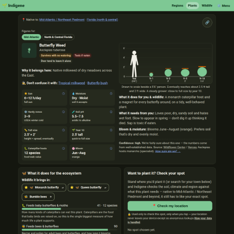](docs/screenshots/pr-78/plant-after-dark.png)
[Before](docs/screenshots/pr-78/plant-before-dark.png) · [After](docs/screenshots/pr-78/plant-after-dark.png)

### Added

- **A new section of the app for the plants that get mistaken for natives.**
  [Look-alikes](https://indigene.app/lookalikes) puts each impostor beside the
  native it's sold as, with the differences you can check standing in front of
  them: a smell, a thorn, a hollow twig. Start with the [Callery
  pear](https://indigene.app/lookalikes/pyrus-calleryana).

- **Every plant page says what it gets confused with, in one line.** Under "Why
  it belongs here" you'll find *Don't confuse it with* and the names, each
  linking to the full comparison.

- **The label says which kind of impostor it is.** Some spread into wild places
  and cost us something; some are ordinary garden plants from elsewhere that do
  no harm. So each is marked *Invasive here*, *Not from here* or *Native here
  too* — for the region you're looking at.

- Internal: new `data/lookalikes.ts` (27 impostors, 36 region-keyed ties) with
  `lib/lookalikes.ts` as its query layer and a dev audit — every tie must cite
  a source, name at least one tell, fill in both sides of every tell, and may
  not call a plant introduced in a region whose own roster lists it as native.
  Status lives on the tie, never the catalog, for exactly that reason.
  `steps/lookalikes.ts` serves `#/lookalikes`, `#/lookalikes/in/<region>` and
  `#/lookalikes/<id>`, all three prerendered with their own share cards.

- Internal: `scripts/check-lookalikes.mjs` (`npm run lookalikes:check`)
  corroborates each tie against iNaturalist's `identifications/similar_species`
  counts — the community's own record of which plants people really do
  misidentify — and with `--suggest` reports frequent confusions the catalog
  says nothing about. It never gates the build: an unbacked tie is usually a
  garden plant nobody photographs in the wild, not a false claim. Provenance
  for the whole layer is written up in `DATA_SOURCES.md`.

- Internal: French vernacular names for twelve of the impostors (TAXREF, plus
  VASCAN for Callery pear), and `check-vernacular.mjs` now verifies look-alike
  names alongside plants and animals. The three Atlantic-France ties are
  translated in full — that region's pages are otherwise entirely in French —
  and `lookalikesUntranslated()` makes the "still in English" notice cover this
  writing too, so a page can't quietly grow an English block.

- Internal: bundle re-measured after the new data — ~250 KB → ~268 KB gzipped;
  the figure updated in `README.md`, `PROJECT_BRIEF.md`, `app/README.md` and
  `docs/ecoregion-plan.md`.

- **Reading about a plant that grows in more than one region? You can switch.**
  Those plants now have a row of buttons under their name — *Figures for:
  Mid-Atlantic · North & Central Florida* — so you can see how the same plant
  behaves somewhere else.

### Changed

- **The little plant drawings are clearer.** The green shapes that stand in for
  a photograph were a mismatched bunch — some solid blobs, some faint outlines,
  all sizes. They're one family now, each drawn to say what it is at a glance.
  See them on [any region's page](https://indigene.app/regions/france-atlantic).

- Internal: `silhouetteFor` in `components/plant-card.ts` now renders a table of
  parts (filled masses, stems stroked at one weight) rather than a single path
  per form with a per-form fill/stroke switch, and the stem weight scales below
  ~20 px so a 17 px chip glyph keeps 1.4 px of ink. The geometry is generated by
  `scripts/gen-form-glyphs.mjs` — edit there and paste its output back over
  `FORM_GLYPHS`. `steps/region.ts` takes a size for `formIcon`, and passes 24
  for section headings against 17 for chips.

- **A plant's page fits a computer screen now.** [A
  plant](https://indigene.app/plants/quercus-alba) on a laptop used to be a
  narrow strip down the middle, five screens tall. Its sections now run in two
  columns, so it's half as tall and "check your spot" comes early. A phone is
  unchanged.

- **An animal's page got the same treatment.** On [an
  animal](https://indigene.app/wildlife/monarch), the plants that keep it going
  are laid out several across instead of one long stack. It's about a third
  shorter on a laptop.

- **The "ZIP or town" box is the size of a ZIP or a town again.** It used to
  stretch to fill the line, which on a wide screen meant a box half a window
  wide waiting for five characters. Unchanged on a phone.

- **The *Figures for* buttons line up with the rest of the page.** On a plant
  that grows in more than one region, the row of region buttons under the name
  was sitting a little further left than everything around it.

- **Where to look a plant up has moved to the very bottom of its page.** The
  list of botanical databases is where you go once this page has run out of
  answers, so it now comes after *Want to plant it? Check your spot* rather than
  before it.

- Internal: `#/plants/<slug>` and `#/wildlife/<id>` share a new layout mode
  (`body[data-layout="profile"]`), which raises `--maxw` to the same 62rem the
  browse indexes use — but only inside `@media (min-width: 64rem)`, so the
  narrow measure holds everywhere below the laptop breakpoint. Each profile's
  pieces are wrapped in `.plant-cols` / `.plant-sections` column containers that
  are `display: contents` until that breakpoint, so the phone DOM flows exactly
  as before; every split is contiguous, so visual order never diverges from DOM
  order. An animal's supporting plants become a `.wildlife-supports` grid
  (`auto-fill`, 24rem floor, so a lone card doesn't stretch across the window),
  and `supportRow` trades its inline styles for `.support-row`. The location
  prompt's `flex: 1 1 7rem` field gains a 14rem cap and the block around it a
  32rem one (`.spot-prompt`), with the plant page's own town search capped to
  match (`.town-search-row`); the GPS button keeps `flex: 0 0 auto` so it can't
  wrap at 360px. Wrapping the profile's pieces moves its paragraphs out of reach
  of `.plant > .kv`, so `.plant-why` and `.lookalike-line` carry the gutter by
  class while the `>` rule stays for the impostor pages, whose card keeps its
  paragraphs as direct children; `.region-switch` joins them and gains the
  gutter it never had. An impostor's own page (`#/lookalikes/<id>`) is a short
  comparison and stays at the reading measure. Verified by pixel-comparing 390px
  full-page captures against `main` in both schemes — identical on every animal
  page, both look-alike pages and seven other routes, and identical in height on
  plant pages (single- and multi-region, with and without a look-alike line),
  where only the last two sections swap — and by checking 360–1920px for
  horizontal overflow (none).

### Fixed

- **A plant that grows in two regions was telling some readers the wrong
  thing.** Butterfly weed survives to zone 3 in the Mid-Atlantic but only zone 8
  in Florida — and the page showed whichever region came first in our list. It
  now shows yours. Seventeen plants affected.

- Internal: `steps/plant.ts` resolves the displayed row via `activeEntry()`
  (`?region=` → `draft.regionOverride` → `regionForSite(draft)` → first) instead
  of `entries[0]`, which was REGIONS-array order. The suitability checker's
  region lede follows it, so page and verdict can't disagree about "here".
  Region is carried as a hash query, not a new route: it's page state, and one
  plant keeps one address and one share link. `shoot.mjs` gains `--then <hash>`
  for photographing a page that depends on the reader's region.

## [0.17] - 2026-07-31

**Real pages, and photos that stay**

[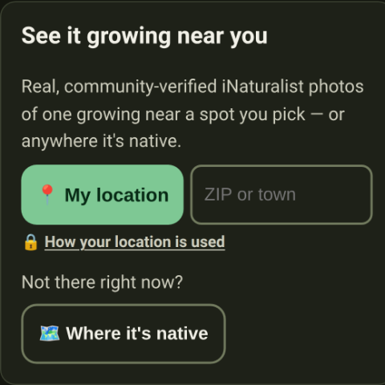](docs/screenshots/pr-74/after-dark.png)
[Before](docs/screenshots/pr-74/before-dark.png) · [After](docs/screenshots/pr-74/after-dark.png)

### Added

- **The preview now describes the page you actually sent.** Every Indigene link
  used to show the same card. Share [butterfly
  weed](https://indigene.app/plants/asclepias-tuberosa) and the card now says
  what it does for monarchs; share [the
  monarch](https://indigene.app/wildlife/monarch) and you get that page's own
  words. 261 pages in all.

- **Found photos are a gallery now.** They used to arrive as a stack of boxes,
  three-quarters of it small grey type. Every photo the lookup found now sits in
  one grid of thumbnails; tap any of them and the big view carries the credit,
  licence and date.

- **Fewer words, fewer boxes, above those photos.** The paragraph explaining the
  lookup is one line. *My location* and the postal-code box share a row instead
  of taking three. The promise about your location is now a link: [how your
  location is used](https://indigene.app/privacy).

- **Photos you've already seen don't download again.** Once a plant's sightings
  have loaded, the pictures are kept on your device, so coming back is instant
  and works with no signal. Indigene keeps the most recent few hundred and lets
  the oldest go.

- **Opening one photo gets the rest ready.** The moment you tap a picture,
  Indigene quietly fetches the full-size version of the others in that set.
  Swiping on to the next one is then immediate — you're walking a gallery, not
  loading a page each time.

- Internal: the service worker gains a bounded, cache-first `PHOTO_CACHE` for
  `inaturalist-open-data.s3.amazonaws.com` and `static.inaturalist.org`. It
  re-issues each ``'s no-cors request in **cors** mode before storing:
  opaque responses are quota-padded (~7 MB each in Chromium), which silently
  exhausted the origin quota at ~132 entries and made every later `put()`
  throw. `store()` now catches a quota rejection, drops the oldest quarter and
  retries once. Verified with Playwright: one network fetch per URL, the 240
  cap holding at 300 distinct photos with the newest kept, and photos still
  rendering after `setOffline(true)`.

- Internal: `lightbox.ts` warms the reel on open — every other frame's
  `largeUrl` fetched serially at `fetchPriority = "low"`, guarded by a
  `reelToken` that goes stale on close. Verified: 6 of 6 larges pulled after
  open, nothing pulled after Escape.

### Fixed

- **A plant's own address used to answer "page not found".** Not to you — the
  app opened fine — but to the machines that build the preview boxes in
  Messages, Slack and WhatsApp. Every page Indigene invites you to share now
  answers as a real page.

- **"See it growing near you" was coming up empty for common plants.** We had
  been asking iNaturalist for the hundred most recent photos of *every* native
  in your region, then hunting for yours among them. Indigene now asks about the
  one plant you're looking at.

- **When iNaturalist is simply busy, Indigene says so.** Every hitch used to
  read "we couldn't reach iNaturalist", which sounds broken. Being asked to slow
  down for a minute now says that instead, so you know to try again.

- **The little captions on the photo thumbnails are gone.** They tried to fit
  "under 1 km away · seen June 2023" into a 90-pixel square, and on a phone,
  which has no hover, you could never see them at all. Tap a photo for all of
  it.

- Internal: `lib/nearby.ts` now queries iNaturalist per taxon
  (`taxon_id=<this plant>`) and caches under `plant:<inatId>:<area>`, replacing
  the region-wide fetch-once-and-index-by-taxon shape. That shape shared a
  100-row page across a region's ~40 natives ordered by `observed_on desc`, so
  coverage collapsed to the last few days in any well-observed area, and
  descendant-rank observations were dropped by the exact-id join. `nativesOnly`
  and `indexByTaxon` are gone — a single-taxon query makes both guarantees hold
  by construction — and `wildlife-sightings.ts` now shares `loadSightings`
  rather than keeping its own copy. HTTP failures throw a typed `InatError`
  carrying the status, so 429/5xx reads as "busy" rather than "unreachable".

- Internal: `scripts/prerender.mjs` runs after `vite build` and writes
  `dist/<route>/index.html` for all 261 shareable routes — the built shell with
  its head metadata swapped for that page's. Titles and descriptions come from
  the app's own English dictionary (`locales/en.ts`) so a card can't drift from
  the page it opens; the plant descriptions are each row's `nativeNote` plus
  `givesNote`. Each copy also gets `hreflang` alternates naming *itself*, which
  is what `index.html`'s comment said needed per-page files. The script fails
  the build if `index.html` grows or loses a share tag it doesn't re-emit.
  `404.html` keeps its bounce for deep links (`/plants/<slug>/ecosystem`),
  flow steps, and the retired `/search` address, and
  `renderExplore`/`renderBrowse`/`renderPlants` now set a `document.title`
  so the app and the prerendered file agree.

## [0.16] - 2026-07-30

**Say what the spot is for**

[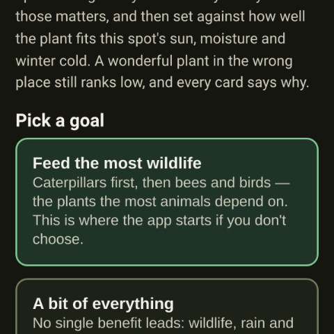](docs/screenshots/pr-72/goals-after-dark.png)
[Before](docs/screenshots/pr-72/goals-before-dark.png) · [After](docs/screenshots/pr-72/goals-after-dark.png)

### Added

- **Indigene asks what you want the spot to do, before it shows you plants.** A
  new **Goals** step sits between the soil question and your list: *feed the
  most wildlife*, *butterflies & moths*, *birds*, *stop erosion*, *soak up
  rain*, *easiest to grow*. The order is now something you chose.
- **You can see what a slider does while you move it.** Open *Fine-tune each
  one* and each slider says its setting in words — "counts a lot", "ignore it" —
  while a panel that follows you down the page names the three plants leading
  right now.
- **Indigene says out loud when it has recalculated — even when nothing moved.**
  Change a goal and a line reports what happened: *"Recomputed — Black Cherry
  now leads"*, or plainly *"the order didn't change"*. Silence used to leave you
  guessing which it was.
- **Tap any plant in your list to open its full page — and get back where you
  left it.** Every card is now a door to that plant's own page, and *"← Back to
  your plant list"* returns you to the plant you tapped, not the top.
- **A bee has moved into the logo.** Point at the Indigene name and a bee
  crosses it looking for pollen, finds only leaves, and trudges home — just as
  the seedling opens into a flower behind its back. It is there to be enjoyed
  and nothing else.

### Changed

- **The cards in your plant list are much shorter.** Each carries what you need
  to decide whether to open it: the name, whether it suits your spot, how big it
  gets, and the two things your goals weighted most. A card used to run two
  screens tall.
- **The plant list is a list again, not a control panel.** The ⚖️ sliders panel
  has moved to the Goals step; in its place a line says what the list was ranked
  for, with a **Change** button. Filters stay — they narrow the list rather than
  reorder it.
- **A heading that leads somewhere now looks like it.** The headings that group
  a region's plants each end in a small green arrow, with the count beside them
  as a quiet round badge instead of "(14)". The plain underline used to run
  under the picture and the bracket.
- **The plants list has a simpler address and a proper wide layout.** It now
  lives at [indigene.app/plants](https://indigene.app/plants), a search is
  shareable as `?q=oak`, and on a laptop the cards spread into three columns
  instead of one phone-width ribbon.
- **The little mark in your tab is a seedling now.** Two pointed leaves rising
  from a bent stem, where it used to be two ovals on a bar — which, shrunk to
  tab size, read as a diagram of something rather than a plant.
- Internal: the app mark is redrawn as a seedling — two pointed, curved leaves
  meeting a bent stem at different heights — replacing the two symmetrical
  ellipses on a straight bar, which read as anatomy rather than botany at icon
  sizes. `scripts/gen-icons.mjs` is now the only place the geometry lives: it
  rasterises the PNG icons *and* writes the vector copies (`public/favicon.svg`
  and the block between the `mark:` markers in `public/404.html`) from the same
  numbers, so the three can no longer drift apart. A leaf is the lens between
  two circular arcs and the stem is a stroked Bézier — evaluated by signed
  distance in the rasteriser, emitted as arc and curve commands in the SVG.

## [0.15] - 2026-07-30

**Indigene speaks French**

[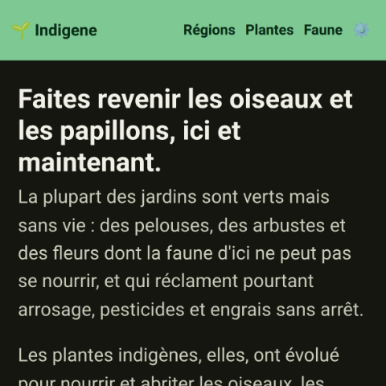](docs/screenshots/pr-66/home-after-fr-dark.png)
[Before](docs/screenshots/pr-66/home-before-fr-dark.png) · [After](docs/screenshots/pr-66/home-after-fr-dark.png)

### Added

- **Indigene speaks French.** Every word of the app is now available in French
  as well as English. It picks your language from your phone the first time, and
  you can change it whenever you like from **Réglages / Settings**.
- **You choose your own units, whatever language you read in.** Metres and °C,
  or feet and °F — the choice is separate from the language, so a French speaker
  gardening in Ohio can read in French and measure in feet. See
  [Settings](https://indigene.app/settings).
- **Plants and animals are called by their French names.** *Quercus robur* is
  "Chêne pédonculé", because that is the name in France's own national list.
  Where nobody has given a plant a French name we show the scientific one rather
  than inventing one.
- **Send someone a link that opens in French.** Put `?lang=fr` on the end of any
  Indigene address and it opens in French for whoever you sent it to. It will
  never overrule them, though: a language they chose themselves stands.
- The size drawing, the plant cards and the "no taller than…" filters all read
  in your units: "24 m × 21 m" or "80 ft × 70 ft", with the ruler marked in
  whole metres or whole feet — never the awkward converted numbers.
- Search engines are now told that Indigene exists in both languages, so a
  French-speaking searcher can be offered the French page.
- **An [About page](https://indigene.app/about)**, linked from the bottom of
  every page. It says why Indigene exists — most gardens are green and nearly
  lifeless — and the five things it refuses to do, including never using a word
  it hasn't explained.
- [Browse by wildlife](https://indigene.app/wildlife) now has a **"Filter by
  name…" box**, the same one the plant lists have. Type "swallow" and the page
  keeps only the swallowtails.
- Each group of creatures also has **its own page** now — just the
  [butterflies](https://indigene.app/wildlife/butterflies), just the
  [moths](https://indigene.app/wildlife/moths), the
  [bees](https://indigene.app/wildlife/bees),
  [birds](https://indigene.app/wildlife/birds) or
  [mammals](https://indigene.app/wildlife/mammals). A row of buttons hops
  between them.
- **Pick a region on the wildlife page and see only the creatures that live
  there.** Choose the Pacific Northwest and [the
  list](https://indigene.app/wildlife) narrows to the 15 creatures its natives
  support. Every combination has its own address, like [the butterflies of the
  French Alps](https://indigene.app/#/wildlife/in/france-alpine/butterflies).
- **Your plant list for a spot has the same "Filter by name…" box.** Type "oak",
  "milkweed", "fern", and the part you typed is underlined in green on each
  match. It searches the whole ranked list, not just the cards on screen.

### Changed

- **The menu at the top of every page now says what each page holds.** "Explore"
  is now **[Regions](https://indigene.app/regions)** and "Search" is now
  **[Plants](https://indigene.app/plants)**. In French the three read
  **Régions**, **Plantes** and **Faune**.
- **The bookmark button is now a ⚙️ menu**, holding your language and units as
  well as your saved spots. The setting that puts the app in your language used
  to be at the bottom of a page you might not be able to read.
- **Language and units are two separate lines, in the menu and in the footer.**
  A globe 🌐 for the language, a ruler 📏 for the units. Written together as
  "English · Imperial" they looked like one setting, and they have never been
  one.
- **The home page no longer stops to ask about language and units** halfway
  down. That belonged in the menu and the footer, not in the middle of the page
  you came to read.
- **Sharing a plant is a small link button at the top of its page**, beside the
  regions it's native to, instead of a full-width button at the bottom. It's in
  reach the moment you recognise a plant, and it no longer spends a whole row of
  a phone screen.
- **Every creature now says where it lives, instead of wearing a "native"
  badge.** Every animal on these pages is native, so the tag told you nothing. A
  creature found in more than one region now shows a pin and a number — 📍 3 for
  the monarch.
- When you filter a region's plant list — say you type "oak" on
  [Florida](https://indigene.app/regions/florida-central) — the part you typed
  is now **underlined in green**, exactly as it already was on the plants page.
- **Your plants come sooner on the page.** The explanation of how the ranking
  works used to sit open above the list, so every visit began with five lines
  about method. It now waits inside **What matters most?**, where you'd go to
  change it anyway.
- **The buttons on your plant list moved below the plants.** "Back" and "Save
  this spot" used to sit above the list, so the first thing on the page that
  finally shows your plants was a way to leave it.
- The French plant descriptions for **Atlantic France** — Paris, Nantes and
  Bordeaux — are written in French. Other regions are still in English while we
  work through them, and any page showing English says so plainly.
- Internal: the filter box, its counting line, and the match underlining now
  come from one shared component (`components/filter-field.ts`) used by the
  region rosters, the wildlife index, and — for the highlighting — the search
  page, instead of three near-copies. It holds no words of its own: every
  sentence is passed in already translated, because a count line doesn't
  survive being assembled from a noun slot in French.
- Internal: `filter-field.ts` splits into two shapes over one field —
  `filterField` hides rows already on the page, `filterBox` hands the query to
  the caller for the ranked list, which has to re-rank rather than hide.
- Internal: a hand-rolled `lib/i18n.ts` (~2 KB, no dependency) over typed
  dictionaries in `app/src/locales/`. English is the key set and every other
  locale is typed against it, so a missing or misspelt key is a compile error,
  not a blank on someone's phone. `lib/units.ts` converts at the display edge —
  the catalog keeps storing feet and °F exactly as sourced, so a units switch
  can never corrupt data.
- Internal: `app/scripts/check-vernacular.mjs` re-asks TAXREF, VASCAN and
  Wikidata whether the names we display are the names they give, and
  `.github/workflows/vernacular.yml` runs it quarterly (the build sandbox's
  egress blocks all three hosts). A name its own source doesn't back fails the
  job; a gap does not.
- Internal: `scripts/shoot.mjs` takes `--locale`, so screenshots can be captured
  as a phone in that region would render them — language *and* default units.
- Internal: the bundle is now ~240 KB gzipped (was ~179 KB) — two full
  dictionaries, the name tables and the French prose overlay. Re-measured and
  updated in `README.md`, `PROJECT_BRIEF.md`, `app/README.md` and
  `docs/ecoregion-plan.md`.
- Internal: the language and units pickers live in
  `components/prefs-controls.ts` rather than inside a screen, so the fuller
  settings screen being built separately can import them and delete the thin
  `steps/settings.ts` shell in one line.
- Internal: `scripts/shoot.mjs` takes a `--fill` flag, so a screenshot can be
  taken of a page whose interesting state only exists once something has been
  typed into it, a `--picks REGION` flag that walks the flow to the ranked
  plant list — the one page no URL can reach, because it needs a spot — and an
  `--open SEL` flag for the panels whose content only exists once opened.

### Fixed

- **Reading in French, being answered in English.** The sentences Indigene
  writes for you personally — "Sun is a good match", "Winters here are too cold
  for it" — were still coming out in English. They now follow your language, and
  your units. Try [white oak](https://indigene.app/plants/quercus-alba).
- **"Fleurit de avril"** — the flowering line said *de avril*, *de août*, which
  is not how anyone writes French. It now reads *Fleurit d'avril à mai*, with
  the months spelled out in full.
- The little line under each nearby sighting — how far away and how long ago —
  was English-only, and always in kilometres. It now follows both your settings:
  "à ~3 km · vue en juin 2023", or miles. So do the descriptions read out by
  screen readers.
- **A page full of English no longer keeps quiet about it.** Every page that
  still has English on it now carries a banner in yellow-and-black hazard
  stripes: "Traduction en cours". You see it before you meet the English, not
  after you've wondered about it.
- Internal: `lib/ranking.ts` and `lib/explore.ts` were building their reason
  strings by hand; both now go through the dictionaries (`fit.*`, `verdict.*`),
  and `ranking.ts`'s private English `sunLabelShort` is gone in favour of
  `plain.ts`'s `sunLabel`. `whereWhen()` in `lib/inaturalist.ts` uses `t()` plus
  new `units.ts` distance formatters. The bloom sentence moved into
  `plain.ts` as `bloomSentence()`, which picks between `card.bloomRange` and
  `card.bloomRangeVowel` so the elision is a translator's choice, not a regex.
  `proseCoverage()` had never been called by anything; it and a new
  `wildlifeUntranslated()` now feed `components/wip-banner.ts`. A step
  *reports* its translation gap while rendering and `main.ts` mounts one
  banner at the top of `main` afterwards, so a page assembled from several
  renderers can't wear three of them and a step can't bury one mid-layout.
- Internal: `scripts/shoot.mjs` takes repeatable `--click` selectors and a
  `--geo lat,lon`, so a screenshot can be taken of a state that only exists
  after a tap — the spot verdict, for one. Its `--picks` walk now finds the
  region link by `data-mode` rather than by its English label, so it works
  under `--locale` too.

## [0.14] - 2026-07-29

**Its own address**

[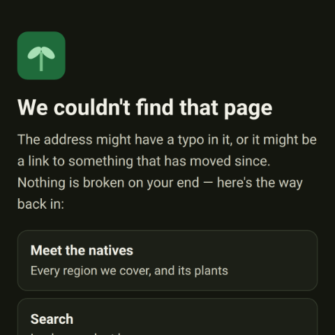](docs/screenshots/pr-62/404-after-dark.png)
[Before](docs/screenshots/pr-62/404-before-dark.png) · [After](docs/screenshots/pr-62/404-after-dark.png)

### Added

- Indigene has a proper little sprout icon in your browser tab now, instead of
  the blank page symbol every site gets when it hasn't been given one.
- Posting an Indigene link somewhere — a message, a group chat, a social post —
  now shows a proper preview card with the name, a line about the app, and the
  sprout, rather than a bare address. For now every link shows the same card.
- Internal: the identifier reconcile job can now ask iNaturalist directly for
  the taxon ids Wikidata's hand-contributed property doesn't carry. Those ids
  are what join a plant's page to the real sightings shown on it, so a missing
  one means "See it growing near you" quietly has nothing to show. Run it from
  Actions → "Reconcile registry identifiers" with scope `missing-inat` (or
  `npm run reconcile -- --missing inat`) and it opens a PR with the result; a
  monthly schedule now runs the same gap-fill on its own, so a newly added
  region doesn't wait on the quarterly full pass.
- Internal: a `Registry` check on pull requests that touch plant data. It
  rebuilds the registry to catch a committed copy drifting from the catalog,
  and annotates the PR with per-region iNaturalist coverage — the gap that let
  21 of the Pacific Northwest's 44 natives, and every French region, ship with
  no taxon ids and nothing to say so. `npm run registry:check` prints the same
  table locally.

### Changed

- Indigene has its own address now: **[indigene.app](https://indigene.app/)**.
  Older links to `olivierlacan.github.io/indigene` still work — they forward to
  the new one — and everything you saved stays where it is on your device.
- The region cards on [Meet the natives](https://indigene.app/plants) no longer
  carry a "USDA 6b–7a" badge. On a page whose only job is "pick where you live",
  it answered a question nobody had asked yet. It's still on every region's own
  page.
- Mistyping an Indigene address used to quietly drop you on the front page, as
  though that's where you'd meant to go. There's now a real **"We couldn't find
  that page"** page that says what happened and offers three ways back in.
- The app's icon had square corners with a faint ghost of a curve near them — a
  rounding that was drawn but never cut out. The corners are round now, in the
  tab and on your home screen.

### Fixed

- The first pages published at [indigene.app](https://indigene.app/) arrived as
  a bare list of blue links, with no colours or layout: the page was asking for
  its styles at the old address, one folder deeper. It looks and works the way
  it always has again.
- Sharing a plant's own web address, like
  [indigene.app/plants/quercus-alba](https://indigene.app/plants/quercus-alba),
  works again on the new domain. Those addresses are handed back to the app on
  arrival, and the hand-off still assumed the old site.
- Internal: the deploy builds with `BASE_PATH: /` rather than reading
  `configure-pages`' `base_path`, which reports `/indigene` for a project Pages
  site and produced the 404ing `/indigene/assets/…` URLs. `app/public/CNAME`
  now ships the custom domain in the artifact, `404.html` folds the whole path
  into the hash route, and the release-notes pages declare their canonical URLs
  under `indigene.app`.
- Internal: reconcile no longer discards every identifier it found for a taxon
  just because neither IPNI nor World Flora Online had an entry to anchor it
  to. The anchor decides `primaryId`, not whether the rest of the bag is worth
  keeping — a plant iNaturalist knows and IPNI doesn't still deserves its
  sightings link.
- Internal: `app/package-lock.json` caught up with the 0.13 version bump.

## [0.13] - 2026-07-29

**More places, and a better way in**

[Before](docs/screenshots/pr-56/explore-before-dark.png) · [After](docs/screenshots/pr-56/explore-after-dark.png)

### Added

- **All of France is covered now, not just the rainy west.** Three more lists,
  each a genuinely different set of plants: [the Mediterranean
  south](https://indigene.app/regions/france-mediterranean), [the continental
  east](https://indigene.app/regions/france-continental) and [the
  Alps](https://indigene.app/regions/france-alpine). The Pyrenees are
  deliberately left out — we'd rather say "not yet" than guess.
- **A lot more to plant in the Pacific Northwest.** [The west-of-the-Cascades
  list](https://indigene.app/regions/pnw) grows from 24 plants to 44 — red
  alder, vine maple, western hemlock, salmonberry, evergreen huckleberry — and,
  for the first time here, a milkweed, the only thing a monarch caterpillar can
  eat.
- **Twenty new creatures on the [wildlife
  pages](https://indigene.app/wildlife)**, most of them European, so browsing by
  animal works for France too. Look up the [large
  blue](https://indigene.app/wildlife/large-blue), whose caterpillar gets
  carried into an ants' nest and spends ten months eating the ants' own young.
- **Every release now has a page of its own.** [What's
  new](https://indigene.app/release-notes/) is one long list, so "look at what
  just shipped" was impossible to share. Tap a release's title and it opens on
  its own, at [an address that stays
  put](https://indigene.app/release-notes/0.12/).
- Indigene now reaches its first place outside the United States: the mild,
  rainy Atlantic west of **France**. Stand there and you'll get [native French
  plants](https://indigene.app/regions/france-atlantic) — oak and hawthorn,
  blackthorn and hazel, bluebells and foxgloves — ranked for your spot. (The app
  itself still speaks English.)
- The app now understands Europe's natural regions, not only North America's.
  Online, it checks the official European map of [biogeographical
  regions](https://www.eea.europa.eu/en/datahub/eea-data-policy) to tell whether
  a French spot is in the Atlantic zone this first list is for, and says so
  plainly when it isn't.
- Elevation and slope now work anywhere in the world, not just the US: outside
  the United States the app reads the land's height from a global source, so the
  new French spots get the same "how high, how steep" reading.
- Internal: the ecoregion layer is now provider-agnostic — a spot resolves to a
  real ecoregion via US EPA (Omernik) in the conterminous US or the EEA
  Biogeographical Regions service in Europe, chosen by coordinates, both falling
  back to the coarse box offline. `EcoregionInfo` carries a `provider` + `code` +
  `name`, and a region declares the codes it covers under `meta.ecoregion`.
  See `docs/france-localization-plan.md`.
- **A page that shows our working.** [Where our numbers come
  from](https://indigene.app/sources) says where every figure comes from, and
  marks each as counted, calculated or estimated. It names the numbers most
  likely to be wrong, starting with our 0–100 scores. We'd rather be corrected
  than believed.
- Internal: the European Lepidoptera host-count source is identified, open, and
  now **integrated** — the Gaytán et al. 2026 species-level European
  Lepidoptera–plant interaction matrix (CC-BY 4.0, `doi:10.1002/ece3.73004`),
  which the dataset's own README confirms records *larval* hosts. A new
  `scripts/build-host-counts.mjs` (`npm run host-counts`) reduces it to a
  committed `data/sources/eu-lep-plant-matrix/host-counts.json` — 973 genera ×
  8 European zones — and reports a region's rows without rewriting them. Counted
  at genus level, filtered to members that grow in the region's zone and are
  native to Europe; the unfiltered figure is kept wherever it differs. The
  shared `HOST_ANCHOR` stays 520 and **no US score moved**. DBIF (CEH/BRC, OGL)
  remains an unrun cross-check. See `docs/host-counts-plan.md`.

### Changed

- **[Explore](https://indigene.app/plants) now leads with places, not
  paragraphs.** It used to open with five plant descriptions, ahead of the one
  thing you actually have to choose: where you are. Each card is now a region,
  with one native starring on the front of it.
- "Or browse by wildlife" has moved **below** the list of regions. It's a good
  way in, but it was being offered before anyone had a chance to look behind the
  first door.
- **Explore, the wildlife list and each region's plant list now use a big screen
  properly.** On a laptop they were a phone-shaped ribbon down the middle; the
  cards now spread into columns. Sentences keep their comfortable reading width
  — it's the cards that wanted the room.
- **The USDA hardiness zone is its own little badge now**, instead of trailing
  in brackets after the place: "Pennsylvania" with a small `USDA 6b–7a` tag
  beside it. Hover or tap-and-hold it and it explains what the zone means.
- **The little counts on each card sit at the bottom now, always in the same
  place.** They used to follow the text, so they landed at a different height on
  every card. They're shorter too — an icon and a number, which stops them
  wrapping on a phone.

- **The French caterpillar counts are now counted, not estimated.** An open
  dataset of 5,152 European butterflies and moths replaced our honest guesses.
  Blackthorn feeds 318 kinds of caterpillar, not the 100 we'd estimated; holly
  feeds 7, not 12. Some French lists are now in a fairer order.
- **"Where our numbers come from" is easier to read.** [The
  page](https://indigene.app/sources) was one long list ending in capsules —
  COUNTED, WORKED OUT, OUR ESTIMATE. The numbers are now grouped under
  **Counted**, **Calculated** and **Estimated**, firmest first, with a sentence
  saying what each means.
- Internal: `make-thumb.mjs` takes `--top <px>`, starting the square that many
  source pixels down instead of at the very top of the capture. A release
  whose feature sits below the fold of a full-page screenshot (0.12's "See it
  near you" section) can now show the feature rather than the page header.
- Internal: `build-release-notes.mjs` writes `release-notes/<version>/` for
  every release alongside the index, and both declare a `<link rel=canonical>`
  built from a new `SITE` constant — so a release has one address rather than
  competing with an anchor on the index. The release card renderer is shared:
  on the index its heading links to the release's page, on that page it is the
  `h1`. Thumbnails are copied once into the notes folder and reached from a
  release page one directory up. The whole `dist/` is already uploaded by the
  Pages deploy, so the subdirectories ship with no workflow change.

### Fixed

- **The menu at the top of the app no longer spills onto a second line.** On
  many phones the row of links had grown just wide enough to drop below the
  Indigene name, making the green bar taller than it needed to be.
- **Tapping "Explore" or "Wildlife" at the top of the screen now always takes
  you to the top of that page.** The page could end up nudged down by the height
  of the green bar, and tapping the section you were already in did nothing at
  all.
- Internal: `main.focus()` scrolls `#main` into view, and `#main` starts below
  the sticky header — measurably parking the document 61px down. The
  `scrollTo(0, 0)` on the next line masked it wherever focus scrolling is
  synchronous; now the scroll happens first and the focus call passes
  `preventScroll`. A delegated handler on `.site-nav` catches same-hash clicks,
  which fire no `hashchange` and so never reached the router.
- Internal: the registry builder and its audit each kept a hardcoded list of
  regions, and both had silently fallen behind — Atlantic France shipped
  without ever reaching the registry. Both now read `data/regions.ts`. The
  registry goes from 116 to 198 taxa.
- Internal: region coverage boxes may now overlap. France's four
  biogeographical zones interlock and no set of rectangles separates them, so
  `regionsForCoords` returns every candidate box and the live ecoregion code
  picks between them; offline, the tightest box wins. Verified against 17
  French cities in both modes, and Bend, Oregon still correctly falls through
  to no list east of the Cascade crest.
- Internal: `docs/coverage-plan.md` records how to decide which natives a
  region needs next, and which open datasets (GBIF occurrences, USDA PLANTS
  county data, WCVP, DBIF, GloBI, iNaturalist phenology) can carry which
  field. The bundle figure quoted across the docs is re-measured: ~125 KB →
  ~179 KB gzipped.

## [0.12] - 2026-07-28

**See it near you**

[Before](docs/screenshots/pr-46/before-dark.png) · [After](docs/screenshots/pr-46/after-dark.png)

### Added

- **See the wildlife near you.** Every creature in the [wildlife
  browser](https://indigene.app/wildlife) now has a "See it near you" section:
  share your location or type a ZIP code, and Indigene pulls real, credited
  photos of that animal spotted near there, live from iNaturalist.
- **Don't want to share your exact location? Type a ZIP code instead.** "See it
  near you" and "See it growing near you" now offer sharing your location and
  typing a ZIP code as two equal choices. It works the same on a desktop with no
  GPS.
- Internal: the wildlife layer identifies each animal to iNaturalist by its
  scientific name (already curated in the catalog), resolving it to a taxon id
  at request time via iNaturalist's taxa endpoint — synonym-tolerant, and it
  fails safe (an unresolvable name shows nothing rather than the wrong
  creature). Sightings are cached per animal + area in IndexedDB for 7 days,
  reusing the plant layer's cache machinery (`lib/inaturalist.ts`,
  `lib/wildlife-sightings.ts`). The shared photo-card and credit rendering now
  lives in `components/observation-ui.ts`, used by both the plant and wildlife
  "near you" sections; the ZIP/location choice is a shared
  `components/location-prompt.ts` used by both, feeding the existing Open-Meteo
  geocoder.
- **A [Privacy & safety page](https://indigene.app/privacy)**, in plain words
  for everyone — including kids and the grown-ups looking out for them. No
  account, no tracking, no ads; your saved spots stay on your device; and it
  names every public science service your browser talks to.
- Internal: the Privacy & safety page and its contextual links go through a
  shared `components/privacy-link.ts`. Combined with the wildlife-sightings
  work above, the bundle is now ~111 KB gzipped.
- Every [region's page](https://indigene.app/regions/mid-atlantic) now opens
  with the same number tiles a plant's page has: how many natives are on the
  list, how many caterpillars its best plant feeds, how much wildlife we can
  name, how many keystone plants. Tap a tile for what it means.
- A filter box on region pages: start typing a name — common or scientific —
  and the plant list narrows as you type, no more hunting through 40 rows or
  bouncing out to the search page.
- The category buttons on region pages (Trees, Shrubs, Ferns…) now each carry
  their little plant silhouette, matching the drawings on the plant rows below.

### Changed

- **One tap now takes you through every sighting's photos, not just one
  person's.** The viewer used to stop at the edge of the sighting you tapped.
  The arrows now carry on into the next, telling you where you are: "9 / 11 ·
  sighting 3 of 4".
- **Bigger, tidier photo thumbnails.** A sighting's little squares now sit three
  to a row and fill the card, instead of leaving a lonely fourth picture on a
  second row. Where there are more than fit, the last wears a "+2" badge.
- Internal: `observation-ui.ts` now exports `observationList()` rather than a
  per-card builder, which is what lets a thumbnail hand the lightbox the whole
  set of sightings on screen; the lightbox holds a flattened reel of
  `{photo, observation}` frames and rebuilds its credit block per frame.
  `whereWhen()` moved to `lib/inaturalist.ts` (both the card and the lightbox
  print it now, and components → lib keeps the imports one-way). New
  `app/scripts/shoot-sightings.mjs` screenshots the "near you" sections with
  iNaturalist's API and photos stubbed, for containers with no route to it.
- Opening a sighting photo is smoother now. The viewer used to open small, jump
  taller, then draw the photo in stuttery strips. It now opens at full size,
  shows a spinner while the photo travels, and fades it in gently.
- Region pages now lead with just the region's name — "Mid-Atlantic /
  Northeast Piedmont" instead of "Every native we know for Mid-Atlantic /
  Northeast Piedmont" — and say the rest in one short line underneath.
- The showcase cards on [Meet the natives](https://indigene.app/#/plants)
  are more compact: the keystone mark now sits beside the plant's name as a
  small arch, and "Full profile →" tucks in at the end of the description
  instead of taking a line of its own.
- The fine print about what "native" means on a region's page is shorter and
  plainer: native here means native to this region specifically — outside it,
  treat the picks as untested.
- The [Where are you standing?](https://indigene.app/#/location) step now shows
  one way of setting your spot at a time. Using your device's location leads,
  and a small link swaps in the town search or the region list. Less to scroll
  past, and Next is always close by.
- Picking your region by hand is now two taps: choose a region and the list
  folds down to just your choice (a "Show all regions" link brings the rest
  back), then press Next when you're sure — instead of being whisked to the
  next step the moment you tap.

## [0.11] - 2026-07-28

**Never a blank page**

### Added

- A public [What's new page](https://indigene.app/release-notes/):
  every release of Indigene described in plain words, newest first. Nothing to
  install, no account — it's just a web page you can share.
- A "See what's new" link in the app's footer, so the notes are one tap away.
- Each release on the What's new page can now show a small picture of what
  changed, taken when the change was made. Tap it to see the full-size
  screenshot; Before and After links sit underneath when both exist.

### Changed

- The footer — the fine print about open source and data sources, plus the
  "See what's new" link — now appears at the bottom of every page, not just
  the home screen.
- The little person standing beside each plant in the growth chart now looks
  like a person — head, shoulders, arms and legs — instead of a featureless
  post, at every size from towering oak to knee-high wildflower.
- The growth chart's labels are a touch bigger and drawn in the page's
  strongest text color, so the feet markings and year captions are easy to
  read in both light and dark mode — even in bright sun.
- When you [search for a plant](https://indigene.app/plants), each result now
  underlines the part of its name that matches what you typed. And when a plant
  matched through a less common name — "Maypop" for Purple Passionflower — the
  result says so.
- The What's new page now uses the changelog's own headings — Added, Changed,
  Fixed — instead of renaming them.
- Release notes now link to the things they describe — like the
  [wildlife browser](https://indigene.app/#/wildlife) — so
  you can go straight from reading about a feature to trying it.
- Internal: this `CHANGELOG.md` is the single source of the What's new page.
  `app/scripts/build-release-notes.mjs` compiles it to a static, app-styled
  HTML page; the Pages deploy workflow runs it on every push to `main`, and a
  `Changelog entry` PR check reminds authors to update this file (apply the
  `skip-changelog` label when nothing notable changed). `app/package.json`'s
  `version` tracks the latest cut release.
- Internal: one thumbnail per release, enforced by the compiler — a square
  480px crop made with `node scripts/make-thumb.mjs <screenshot.png>`,
  committed next to its source under `docs/screenshots/pr-<n>/`, referenced
  as `` under the release name. Thumbnails
  are copied into the built page; full-size screenshots and other
  repo-relative links are served straight from `raw.githubusercontent.com`.
- Internal: there is no custom `Internal` changelog section — the sections
  are exactly Keep a Changelog's. A bullet prefixed `Internal:` (like this
  one) stays in the changelog and is cleaned out of the compiled page.

### Fixed

- The home page could come up completely blank — most often in Safari, and
  especially with an older Indigene tab open in another window. The app was
  waiting forever for its on-device storage to answer. It now draws the page
  right away.
- The page now appears instantly on every load — the brief pause some
  browsers still showed is gone, because nothing waits on on-device storage
  before drawing anymore.
- The Saved menu no longer sticks on "Loading…" when on-device storage won't
  answer (Safari sometimes leaves it hanging). After a couple of seconds it
  says it couldn't open your saved spots, suggests closing other Indigene
  tabs, and offers a Try again button.
- "See it growing near you" could get stuck at "Asking iNaturalist…" for the
  same reason — the app checks its on-device photo cache before asking, and
  that check could hang forever. It now gives the cache a couple of seconds,
  then asks iNaturalist directly.
- The bottom row of the growth chart's labels — like "(5′6″)" under the
  little person — was getting cut off by the caption below. The chart now
  leaves proper room for both label rows.
- The growth chart could be drawn with the wrong colors — pale, hard-to-read
  labels on a light page — if your device switched between light and dark
  looks after the page loaded. The chart now redraws itself when that
  happens, and also when the screen size changes.
- The app's top menu now wraps onto a second line when it truly runs out of
  room — like with very large text settings — instead of quietly spilling off
  the edge of the screen, where the Saved button could end up out of reach.
- Internal: the page can no longer scroll sideways (`overflow-x: clip` on
  `body`). The overflowing header was silently widening the document, which
  is what put a dark right-edge gutter and a floating 🔖 in every full-page
  screenshot: the capture honors the document width while the sticky header
  only spans the viewport. A fresh capture's width must now equal the
  viewport width. The four release thumbnails that had the gutter baked in
  (0.7–0.10) were regenerated with `make-thumb.mjs --crop`, which trims
  legacy captures to their true viewport width.
- Internal: screenshots now render with real phone font metrics. The capture
  container has none of the app's named fonts, so text fell through to DejaVu
  Sans (~10% wider than a phone renders — which is what made the header
  overflow, then wrap, in captures). A SessionStart hook
  (`.claude/hooks/session-start.sh`) installs Roboto and points `system-ui`
  at it, so headless Chromium lays out like an Android phone; the nav also
  sits a touch tighter at phone widths, so it fits Roboto with room to spare
  instead of by one pixel. Screenshots are also hi-DPI now: a new
  `scripts/shoot.mjs` (playwright joins the dev dependencies) captures at a
  real phone's 3× pixel ratio, so embedded shots render crisp on retina
  displays — with `--dpr 1` kept for very long full-page records.

## [0.10] - 2026-07-27

**Everything in plain sight**

[Before](docs/screenshots/pr-36/home-before-dark.png) · [After](docs/screenshots/pr-36/home-after-dark.png)

### Added

- A [Browse page](https://indigene.app/#/browse) of its
  own: the regions we cover and "start from a plant" now live one tap from
  the home page — for anyone who'd rather look around
  without sharing their location.

### Changed

- Almost nothing hides behind a tap anymore. A plant's ecosystem, propagation
  and reference sections, the 60-second soil check and each result's score
  breakdown are simply visible on the page. Only the two big panels on results
  still fold away.
- The home page gets to the point: the pitch, why native plants matter (in
  plain view, no tap needed), the Start button, and a quiet link to browsing.
- Words got shorter and warmer across the home page, including the promise
  that matters most: "No account, no tracking. Everything stays in your
  browser and works offline."

### Fixed

- Buttons on phones now keep their labels on one line — like "See it growing
  near me" and "Check my location" — so they never break in half or shift
  while you're reaching for them.

## [0.9] - 2026-07-27

**See them growing for real**

[Before](docs/screenshots/pr-32/before-dark.png) · [After](docs/screenshots/pr-32/after-dark.png)

### Added

- Real photos of recommended plants growing near you, taken by people in your
  area and shared on [iNaturalist](https://www.inaturalist.org). Open a
  plant's page and tap "See it growing near you" — nothing loads until you ask.
- Not standing there right now? Tap "Look it up where it's native" and pick a
  region instead: you'll see photos of the plant from anywhere it naturally
  grows, no location sharing needed.
- Photos open in a full-screen viewer inside the app, so you can look closely
  and then get right back to where you were.

### Changed

- Nearby photo results only show plants that are truly native around that
  spot, so a garden escapee never sneaks into your recommendations.
- Every photo credits the person who took it and links back to their original
  sighting, and only photos their takers chose to share openly are shown.

## [0.8] - 2026-07-22

**One plant, one name**

[Before](docs/screenshots/pr-25/plant-refs-before-dark.png) · [After](docs/screenshots/pr-25/plant-refs-after-dark.png)

### Added

- A built-in plant name book (a *registry*): every plant Indigene knows has
  exactly one entry tying together its scientific name, its common names, and
  its identity in the world's big plant databases.
- A [search page](https://indigene.app/#/search): type any
  name — common or scientific — and Indigene finds the
  plant, or says honestly when a name could mean more than one plant.
- Plant pages now show **references**: links to the very same plant at USDA,
  GBIF, and other authorities, so you can double-check anything we say.
- iNaturalist links now land directly on that exact species' page.
- Internal: the registry is generated from the catalog (`npm run
  registry:build`) and audited (`npm run registry:check`); it also ships as a
  hostable static JSON artifact under `app/public/registry/`. External
  identifiers (Wikidata + GBIF) are reconciled by a scheduled workflow that
  writes to `registry.overrides.json` via PRs; the workflow was hardened to
  not red-fail when PR creation is blocked, and `registry:check` now survives
  reconciliation.

### Fixed

- Internal: corrected the long-stale bundle-size figure across the docs
  (~28 → ~96 KB gzip) and documented keeping it honest in `CLAUDE.md`.

## [0.7] - 2026-07-21

**Meet the wildlife**

[Before](docs/screenshots/pr-18/plant-milkweed-before-dark.png) · [After](docs/screenshots/pr-18/plant-milkweed-after-dark.png)

### Added

- [Browse by wildlife](https://indigene.app/#/wildlife):
  start from a butterfly, moth, bee, bird, or mammal and
  see which native plants support it — because "which plants bring monarchs?"
  is often the real question.
- Every plant–animal tie says *how* the plant helps (caterpillar food, nectar,
  berries, seeds, or shelter) and how much the animal depends on it — from
  "this is its only host plant" to "one of many it can use".
- Every wildlife relationship names its source, with links straight to the
  species record where the source has one.
- Plant pages show the wildlife each plant brings in, with links both ways.

### Changed

- You can now cap results by mature height and spread — handy for planting
  under a window or a power line.
- The header now fits every phone: "Saved" moved into a compact menu, and the
  app's name is never cut off.
- Relationship tags are one short word each; tap one to read the full meaning.

### Fixed

- Wildlife pages got the same comfortable margins as the rest of the app.

## [0.6] - 2026-07-19

**Readable by everyone**

[Before](docs/screenshots/pr-17/welcome-before-dark.png) · [After](docs/screenshots/pr-17/welcome-after-dark.png)

### Changed

- The home page now leads with why native plants matter — what's at stake for
  birds, butterflies, and clean water — before it explains what the app does,
  and shows how to ask for your area if it isn't covered yet.
- Every color in the app, in light mode and dark mode, now meets the strictest
  readability standard there is (WCAG AAA contrast) — so text stays clear in
  bright sunlight, and for readers whose eyes need more contrast.

## [0.5] - 2026-07-18

**Make more of them**

### Added

- Every plant now has "how to make more of it": plain-words tips for growing
  new plants from seed, cuttings, or division — free plants for you, your
  neighbors, and the birds.

### Changed

- Every expandable section in the app now looks and works the same way — once
  you've opened one, you know how to open them all.
- Section titles are shorter and clearer, and the first step is now simply
  called "Spot".
- You can share a link that opens a specific section of a plant's page, like
  its propagation tips.

## [0.4] - 2026-07-17

**No GPS required**

### Added

- Type your town or ZIP code instead of sharing your location — or just pick
  your region from a list. Nobody is ever asked for coordinates.
- If Indigene doesn't have a plant list for a spot yet, it says so the moment
  you pick it — and shows you what it does cover, plus where to request your
  area.

### Changed

- Place lookups now come from OpenStreetMap, and the app always shows town
  names, never raw numbers.
- Garden jargon never stands alone: terms like "zone 8b" always come with a
  plain-words translation and a link to learn more.

### Fixed

- The place-search button now sits right beside the search box, at a matching
  size.
- The map no longer promises that fine-tuning the pin sharpens the sun
  estimate (it doesn't).

## [0.3] - 2026-07-16

**Explore and share**

### Added

- [Explore pages](https://indigene.app/#/explore): browse
  every plant Indigene knows without sharing your
  location — and every plant, region, and category has its own address you can
  share with anyone.
- Full plant lists for each region at shareable addresses, with a switcher to
  hop between regions.
- A stat grid on every plant, like a trading card. Tap any stat to read what
  it means in plain words.
- The location map now draws real streets from OpenStreetMap (with a simple
  grid when you're offline).
- Short explanations appear right where a new idea first shows up, so you
  learn as you go — and growth expectations now come from the data, not
  guesses.

### Changed

- Getting around got easier: section navigation, a way back home from every
  page, and region links right on the home page.
- The re-sort panel can be closed, the growth chart is right-sized, keystone
  species wear a little arch icon, and species counts show their sources.
- The GPS map starts one zoom level farther out, so the neighborhood you see
  is one you recognize.

## [0.2] - 2026-07-15

**More places, real boundaries**

### Added

- Three new regional plant lists: the Pacific Northwest west of the Cascades,
  north & central Florida, and south Florida & the Keys — and the app picks
  the right list from where you're standing.
- Regions now follow real ecological boundaries (EPA ecoregions), not straight
  lines on a map — so a spot just east of the Cascade crest no longer gets the
  west-side list, and Florida splits where the subtropics truly begin. The
  confirm screen names the actual ecoregion you're standing in.
- Every plant's naming and classification is backed by named, linkable
  taxonomy sources.
- Indigene went live on the public web — free to visit in any browser, nothing
  to install (though you can add it to your home screen).
- Internal: deploys to GitHub Pages via Actions on every push to `main`; the
  optional Ruby API is not part of the deploy.

## [0.1] - 2026-07-12

**Stand in a spot**

### Added

- The first version of Indigene. Stand somewhere, share your location, and get
  native plants that will truly thrive right there — ranked by what they do
  for birds, butterflies, bees, soil, and water.
- Sun, measured honestly: answer one simple question about your spot's sun, or
  point your camera at the sky and let the app measure sun-hours itself. The
  simple question always works; the camera is optional.
- The ground gets checked, not assumed: the app says "the soil map says clay —
  here's a 60-second hand test to see if that's true where you're standing."
- Every plant shows how big it will really get in 1, 3, 5, and 10 years, drawn
  to scale beside a person — no surprises a decade later.
- The ranking is transparent and yours to adjust, with filters for deer
  resistance, thorns, pet safety, and plants that survive with zero watering.
- Saved spots stay on your phone. The whole app works offline, installs to
  your home screen, and never asks for an account.
- A starting list of 40 Mid-Atlantic / Northeast Piedmont natives with real
  size-over-time and ecosystem numbers.
- Internal: vanilla TypeScript on the DOM — no framework, zero runtime
  dependencies — bundled by Vite. A thin, optional Hanami 2 API (`server/`)
  proxies site data; the PWA works without it.

[Unreleased]: https://github.com/olivierlacan/indigene/compare/8f6327b...HEAD
[0.24]: https://github.com/olivierlacan/indigene/compare/e8860f8...8f6327b
[0.23]: https://github.com/olivierlacan/indigene/compare/221a9ee...e8860f8
[0.22]: https://github.com/olivierlacan/indigene/compare/9f09ba2...221a9ee
[0.21]: https://github.com/olivierlacan/indigene/compare/1774027...9f09ba2
[0.20]: https://github.com/olivierlacan/indigene/compare/ccf78ee...1774027
[0.19]: https://github.com/olivierlacan/indigene/compare/9cc18dd...ccf78ee
[0.18]: https://github.com/olivierlacan/indigene/compare/ccd214c...9cc18dd
[0.17]: https://github.com/olivierlacan/indigene/compare/5200de0...ccd214c
[0.16]: https://github.com/olivierlacan/indigene/compare/aaa7781...5200de0
[0.15]: https://github.com/olivierlacan/indigene/compare/318f221...aaa7781
[0.14]: https://github.com/olivierlacan/indigene/compare/d81160b...318f221
[0.13]: https://github.com/olivierlacan/indigene/compare/fa0dd4c...d81160b
[0.12]: https://github.com/olivierlacan/indigene/compare/2aec57f...fa0dd4c
[0.11]: https://github.com/olivierlacan/indigene/compare/f84450c...2aec57f
[0.10]: https://github.com/olivierlacan/indigene/compare/9453251...f84450c
[0.9]: https://github.com/olivierlacan/indigene/compare/6e72889...9453251
[0.8]: https://github.com/olivierlacan/indigene/compare/d45eda0...6e72889
[0.7]: https://github.com/olivierlacan/indigene/compare/6affce6...d45eda0
[0.6]: https://github.com/olivierlacan/indigene/compare/c8a56bc...6affce6
[0.5]: https://github.com/olivierlacan/indigene/compare/a54ef90...c8a56bc
[0.4]: https://github.com/olivierlacan/indigene/compare/253bede...a54ef90
[0.3]: https://github.com/olivierlacan/indigene/compare/c0e70f6...253bede
[0.2]: https://github.com/olivierlacan/indigene/compare/ac8be53...c0e70f6
[0.1]: https://github.com/olivierlacan/indigene/commits/ac8be53
